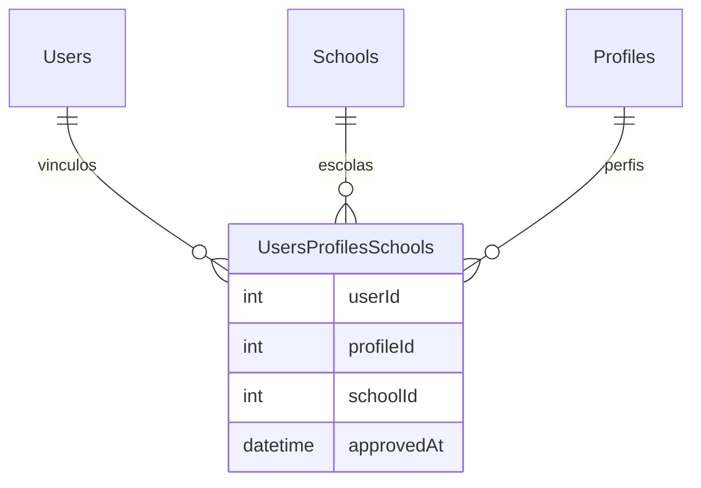
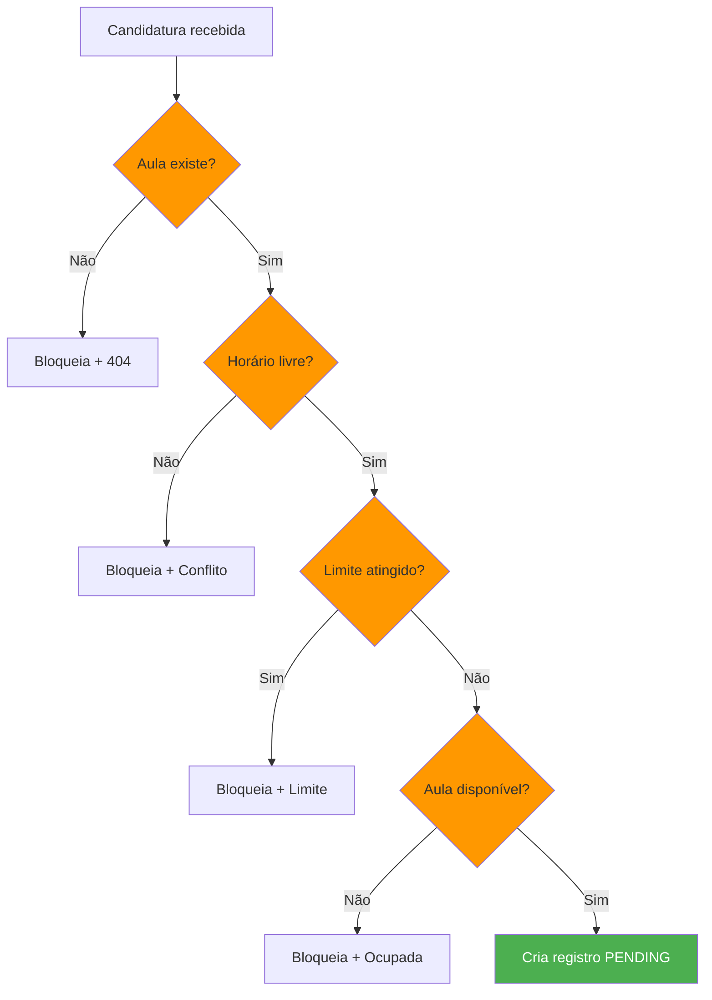
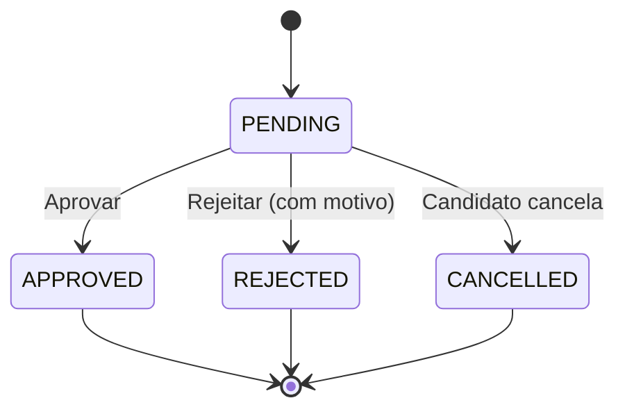

# Regras de Negócio

Este documento descreve as regras de negócio do sistema Troca Aula, definindo quem pode fazer o que e em quais condições.

## Regras de Autenticação

### R001 - Login de Usuário
- O usuário deve fornecer email e senha válidos
- No frontend, a senha é enviada em texto puro sob TLS (sem pré-hash no cliente desde o P3)
- O backend compara e, em caso de sucesso, retorna um token JWT (`access_token`)
- Em caso de erro, retorna `401 Unauthorized`

### R002 - Token JWT
- Token é armazenado em cookie `httpOnly` chamado `token` com duração de 7 dias
- O token contém o ID do usuário no payload (`sub`)
- O proxy do Next.js valida a assinatura e a expiração do JWT do cookie `token` nas rotas protegidas (cookie ausente/inválido → redirect para `/`)
- A rota `/api/auth/me` valida o token com `jose.jwtVerify` usando a variável `SECRET`

### R003 - Logout
- A rota `/api/auth/logout` limpa o cookie `token` (maxAge 0)
- O hook `useUserHook.logout()` limpa o estado e redireciona para `/`

## Regras de Perfis

### R013 - Perfis de Usuário (mapeamento real do backend)

| ID | Nome | Descrição |
|----|------|-----------|
| 1 | DIRETOR | Governa uma escola específica (cria vagas, aprova candidaturas) |
| 2 | AUXILIAR_ADMIN | Opera as substituições de uma escola (cria vagas, gerencia operacional) |
| 3 | PROFESSOR | Se candidata a aulas vagas e pode cancelar a própria candidatura |
| 4 | MASTER | Acesso completo ao sistema (gerencia redes, escolas, diretores, administradores, professores) |

> **Correção (Fase 3/P1):** esta tabela antes trazia o "mapeamento novo" planejado (`1=MASTER, 2=DIRETOR, 3=ADMIN, 4=PROFESSOR`), que **nunca** correspondeu ao backend — o valor real é o da tabela acima (`ProfileEnum` do backend, espelhado em `src/constants/profile.ts`). O módulo legado também usava outro mapeamento errado; ambos foram unificados. Ver [problemas-conhecidos.md](../06-status/problemas-conhecidos.md) (P1).

### R014 - Relação Usuário-Escola-Perfil
Um usuário pode ter múltiplos vínculos com diferentes escolas e perfis:

## Regras de Classes (Aulas)

### R011 - Criar Aula Vaga
**Quem pode**: Diretor ou Administrador (e, no dashboard legado, admin/diretor).

Campos usados no frontend:
- `schoolId` (escola)
- `subjectId` (disciplina)
- `statededAt` (início — nome incorreto persistido na API)
- `finishedAt` (término)
- `available` (disponível para candidatura)

### R012 - Visualização de Aulas
- **Admin/Diretor**: vê todas as aulas
- **Professor**: vê aulas disponíveis (`?available=true`) e suas próprias candidaturas

## Regras de Candidatura (Enrollment)

### R009 - Inscrever-se em Aula
**Quem pode**: Qualquer professor autenticado.

**Validações** (no backend):
- Aula deve existir
- Aula deve estar disponível
- Professor não pode estar inscrito duas vezes na mesma aula

### R010 - Cancelar Candidatura
**Quem pode**: Apenas o professor que criou a candidatura, e somente se o status for `PENDING`.

**Validações**:
- Candidatura deve existir
- Apenas o autor pode cancelar

### Estados de uma Candidatura

## Regras de Limite de Substituições

### R015 - Teto por Semestre
- Cada usuário tem `substitutionLimitPerSemester` (definido no cadastro/gestão)
- O limite é contado sobre candidaturas **APROVADAS** no semestre corrente (jan/01 ou jul/01)
- Se `percentage >= 100`, o professor não pode mais se candidatar (`canApply = false`)
- Se o limite for `null`, não há restrição

## Casos de Erro Comuns (backend)

| Código | Mensagem | Causa |
|--------|----------|-------|
| 400 | Conflito de horário detectado | Professor já tem aula no mesmo horário |
| 400 | Solicitação não está pendente | Status não é PENDING |
| 400 | Você já está inscrito nesta aula | Candidatura duplicada |
| 401 | Credenciais inválidas | Email/senha incorretos |
| 403 | Apenas diretor ou admin pode criar | Perfil não autorizado |
| 403 | Você só pode aceitar aulas da sua matéria | subjectId diferente |
| 404 | Usuário não encontrado | ID inválido |
| 404 | Aula não encontrada | ID inválido |

## O Que o Sistema Não É

- Não é um diário de classe eletrônico
- Não é um controle de frequência regular
- Não é uma rede social
- Não é um sistema de RH completo
- Não é um aplicativo de mensagens

## Funcionalidades Principais

1. **Criação de aulas vagas**: diretores/administradores cadastram ausências
2. **Busca e candidatura**: professores visualizam e se candidatam a vagas
3. **Controle de limite**: o sistema monitora o teto de substituições por semestre por professor
4. **Aprovação**: diretores/administradores validam candidaturas
5. **Histórico**: registro completo de todas as substituições e candidaturas
6. **Área Master**: gestão centralizada de escolas, diretores, administradores e professores