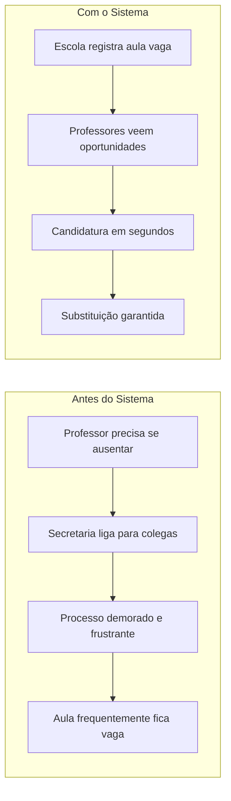
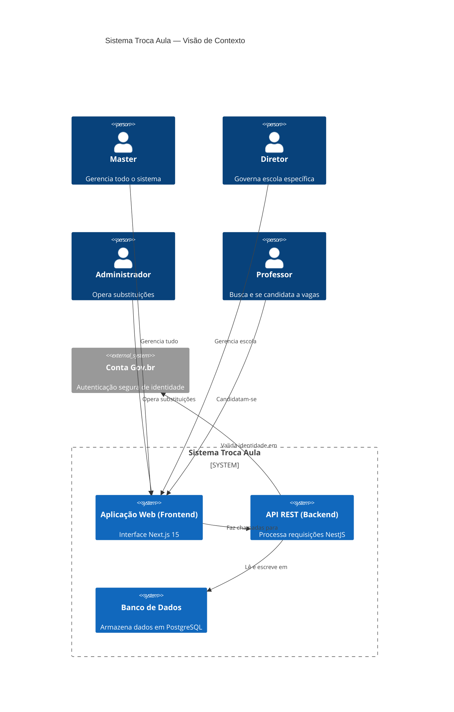

# Visão do Produto — Troca-Aula

## Propósito

O **Troca-Aula** é uma solução digital para facilitar a disponibilização de aulas vagas, ajudando as escolas a reduzir o índice de aulas vazias e garantir a continuidade pedagógica. Quando um professor precisa se ausentar, o sistema conecta a escola a outros professores disponíveis para a substituição de forma automatizada e organizada.

## Problema

A gestão de ausências docentes hoje depende de processos manuais:

- Contatos telefônicos da secretaria para encontrar substitutos
- Planilhas físicas e controle manual de candidaturas
- Tempo excessivo das secretarias escolares
- Interrupção recorrente do calendário letivo, com aulas frequentemente vagas

### Antes vs. Depois

## Personas do Sistema

| # | Perfil | Papel | Acesso típico |
|---|--------|-------|---------------|
| 1 | **Master** | Administrador global, gerencia todo o sistema (escolas, diretores, administradores, professores) | Portal administrativo completo |
| 2 | **Diretor** | Responsável pela governança de uma escola (cria vagas, aprova candidaturas, gerencia professores) | Início da manhã e final do dia |
| 3 | **Administrador** | Coordena a parte operacional das substituições de uma escola | Diário pelo computador na secretaria |
| 4 | **Professor** | Busca oportunidades de aulas extras e se candidata | Principalmente pelo celular |

> **Atenção (inconsistência conhecida):** o código-fonte usa dois mapeamentos de `profileId` diferentes. O módulo legado (dashboard) trata `profileId 1` como admin/diretor, `2` como diretor e `3` como professor; o módulo master e os serviços mais novos tratam `1` = master, `2` = diretor, `3` = administrador e `4` = professor. Detalhes em [perfis-e-permissoes.md](./perfis-e-permissoes.md) e [problemas-conhecidos.md](../06-status/problemas-conhecidos.md).

## Oportunidade

Uma plataforma web escalável e acessível pode otimizar o processo de substituição de aulas, reduzindo a ocorrência de aulas vagas e aumentando a eficiência administrativa nas instituições de ensino.

## Objetivos

### Objetivo Geral
Projetar e evoluir uma plataforma digital dedicada à administração de substituições docentes, otimizando a alocação de profissionais e os fluxos operacionais em ambientes escolares por meio de automação e computação em nuvem.

### Objetivos Específicos

1. **Mitigação de lacunas pedagógicas**: reduzir a incidência de aulas vagas para preservar a integridade do cronograma de ensino.
2. **Inclusividade e acessibilidade**: implementar padrões WCAG (leitores de tela, navegação por teclado, contrastes adequados).
3. **Modernização da infraestrutura**: arquitetura em nuvem com CI/CD via GitHub Actions.
4. **Qualidade e validação**: confiabilidade mediante testes automatizados (Vitest no frontend, Jest no backend).
5. **Segurança e interoperabilidade**: autenticação unificada via API Gov.br.
6. **Gestão de dados**: persistência otimizada em PostgreSQL.

## Diferenciais

- **Inclusão digital**: padrões WCAG para acesso a gestores e professores com deficiência.
- **Automação**: fluxos automatizados de Candidatura → Aprovação → Registro.
- **Integração governamental**: autenticação via Conta Gov.br.
- **Visão de futuro**: integração com IoT para validação automatizada de presença em tempo real.

## Métricas de Sucesso

- Redução do tempo de preenchimento de aulas vagas
- Aumento da taxa de substituição preenchida
- Satisfação dos usuários (professores e administradores)
- Conformidade com padrões de acessibilidade WCAG 2.1

## Stack Tecnológica

| Componente | Tecnologia |
|------------|------------|
| Frontend | Next.js 15, React 19, TypeScript, styled-components |
| Backend | NestJS (API REST) |
| Banco de Dados | PostgreSQL (Prisma ORM) |
| Autenticação | JWT + Gov.br API |
| Testes | Vitest + React Testing Library + MSW |
| Infraestrutura | GitHub Actions, Render/Railway, Docker |

## Modelo de Negócio

O sistema opera como uma ferramenta de gestão escolar, **não sendo**:

- Rede social
- Diário de classe eletrônico
- Sistema de controle de frequência regular
- Sistema de lançamento de notas

Focado exclusivamente na gestão de substituições docentes.

## Glossário de Termos

| Termo | Definição |
|-------|-----------|
| **Aula Vaga** | Aula que ficou sem professor porque o titular precisa se ausentar |
| **Candidatura (Enrollment)** | Ato de um professor se voluntariar para preencher uma aula vaga |
| **Teto de Substituições** | Limite máximo de substituições que um professor pode ter por semestre |
| **Aprovação** | Ato do diretor/administrador validar uma candidatura |
| **Habilitação** | Condição de um professor estar qualificado para ensinar determinada disciplina |

## Arquitetura do Sistema (C4)

