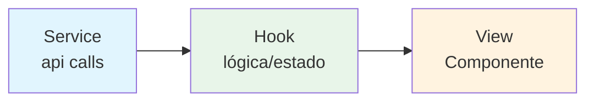
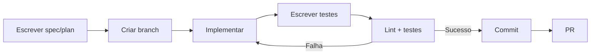

# Convenções de Código

Este documento define as convenções adotadas no frontend Troca-Aula.

## Stack e Padrão de Arquivos

O projeto segue o padrão **Service → Hook/Controller → View**:



| Camada | Pasta | Nome do arquivo | Exemplo |
|--------|-------|-----------------|---------|
| Service | `src/services/` | `*.service.tsx` | `enrollment.service.tsx` |
| Hook | `src/hooks/` | `use*.ts` | `useEnrollments.ts` |
| View | `src/app/`, `src/components/` | `page.tsx`, `Nome.tsx` | `classes/page.tsx`, `StatCard.tsx` |
| Tipos | `src/types/` | `*.ts` | `master.ts` |
| Sessão | `src/user/` | `use*Hook.tsx`, `*.types.tsx` | `useUserHook.tsx` |

## Nomenclatura

- **Componentes**: PascalCase — `Logo.tsx`, `BotaoGovBr.tsx`, `ConfirmModal.tsx`
- **Hooks**: camelCase com prefixo `use` — `useUserHook`, `useEnrollments`, `useSubstitutionLimit`
- **Services**: camelCase, exportados como objeto — `authService`, `masterService`, `teacherService`
- **Tipos/interfaces**: PascalCase — `UserData`, `EnrollmentRequest`, `School`
- **Constantes globais**: `SCREAMING_SNAKE_CASE` — `FILTER_OPTIONS`
- **Variáveis/funções**: camelCase

## Tipos e Arquivos de Tipos

- Tipos de cada domínio ficam em `src/types/` (ex.: `enrollment.ts`, `master.ts`, `teacher.ts`, `auth.ts`)
- Tipos de sessão ficam em `src/user/user.types.tsx`
- Interfaces exportadas por domínio: `School`, `User`, `EnrollmentRequest`, `Class`, `Subject`, `DashboardStats`, etc.

## Estilos

- Usa **styled-components** (v6) com `compiler.styledComponents` habilitado no `next.config.ts`
- Estilos colados ao componente (não há separação obrigatória em `*.styles.ts` — pode-se criar quando o arquivo ficar grande)
- `StyledComponentsRegistry` em `src/lib/registry.tsx` injeta estilos no servidor (SSR)

## Formulários

- `react-hook-form` + `yup` para validação (ex.: cadastro, login, formulários do master)
- `@hookform/resolvers` para integrar Yup ao react-hook-form

## Autenticação e HTTP

- **Login tradicional**: a senha é hasheada no cliente com `Base64(SHA1(senha))` antes de enviar
- **Cookie httpOnly**: token JWT armazenado no cookie `token` pela rota `/api/auth/login`
- **axios**: instância compartilhada em `src/api.service.tsx`
  - `baseURL` = `NEXT_PUBLIC_API_URL || 'http://localhost:5000'`
  - Interceptor de request: adiciona `Authorization: Bearer <token>` a partir do cookie
  - Interceptor de response: exibe `toast.error` com a mensagem do backend

## Padrão de Retorno dos Serviços

Os serviços usam `response.data?.data ?? response.data` para lidar com respostas envelopadas ou não:

```ts
const response = await api.get('/enrollment-requests');
return response.data?.data ?? response.data;
```

## Convenções de Commits

Seguir [Conventional Commits](https://www.conventionalcommits.org) (validade pelo `commitlint`):

```
feat:      Nova funcionalidade
fix:       Correção de bug
docs:      Documentação
refactor:  Refatoração
test:      Testes
chore:     Manutenção
```

Exemplos:
```bash
git commit -m "feat: adiciona contador de substituições"
git commit -m "fix: corrige redirecionamento do login"
git commit -m "docs: atualiza documentação do módulo master"
```

## Lint e TypeScript

- ESLint (`eslint.config.mjs`) com `eslint-config-next`
- Regras relaxadas no projeto: `no-unused-vars`, `no-explicit-any`, `ban-ts-comment`, `exhaustive-deps`, `no-html-link-for-pages` desabilitadas
- O código usa `any`/`@ts-ignore` em alguns pontos (veja [problemas-conhecidos.md](../06-status/problemas-conhecidos.md))

## Fluxo de Trabalho Recomendado



### Nome de branch

Formato: `<issue>-<descricao>` — ex.: `001-master-admin-area`, `fix-003-correcao-logout`.

## Checklist Antes do PR

- [ ] Código segue padrões de nomenclatura
- [ ] Testes passando (`pnpm test`)
- [ ] Lint sem erros (`pnpm lint`)
- [ ] Commits seguem Conventional Commits
- [ ] Documentação atualizada em `docs/` (se aplicável)