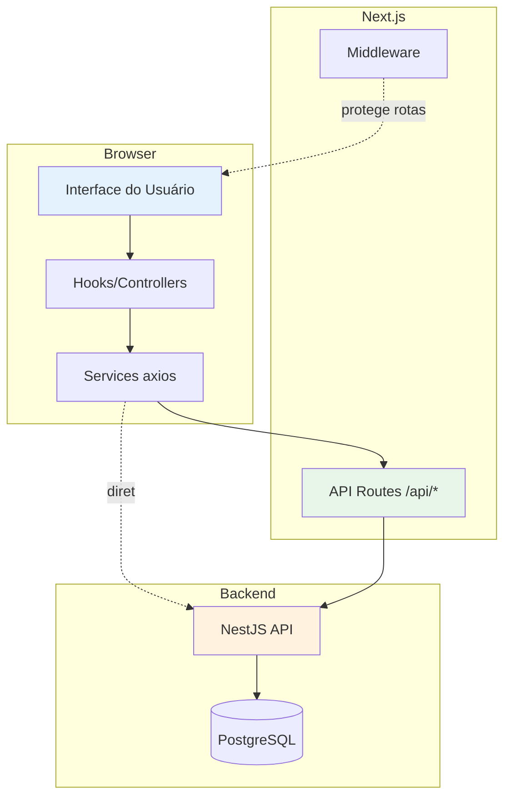
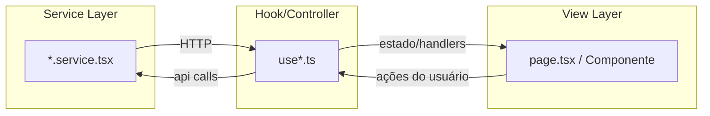
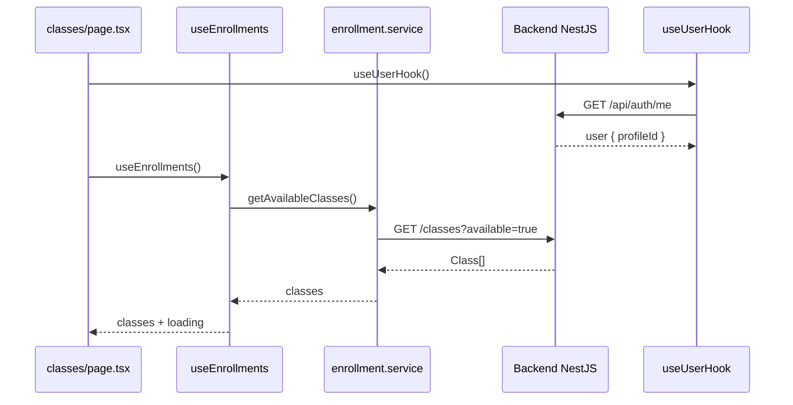
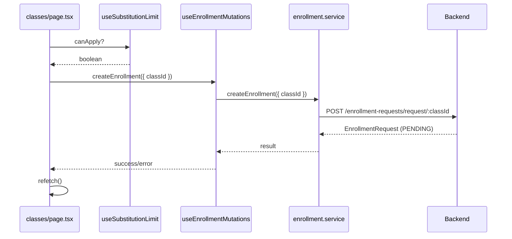

# Arquitetura do Frontend

## Visão Geral

O frontend é um projeto **Next.js 15 com App Router**, TypeScript e styled-components. A comunicação com o backend NestJS é feita via **axios**, em parte diretamente (browser) e em parte via **API Routes do Next.js** (proxy, usadas onde o token httpOnly precisa ser repassado).



## Padrão Arquitetural: Service → Hook → View



- **Services** (`src/services/`): encapsulam chamadas HTTP ao backend
- **Hooks** (`src/hooks/`): gerenciam estado, loading, erro e refetch; expõem handlers para as views
- **Views** (`src/app/`, `src/components/`): componentes React (styled-components)

## Camadas do Projeto

```
src/
├── app/                    # Rotas e páginas (App Router)
│   ├── page.tsx           # Login
│   ├── cadastro/          # Cadastro
│   ├── dashboard/         # Dashboard legado
│   ├── classes/           # Aulas disponíveis (professor)
│   ├── minhas-aulas/      # Minhas candidaturas
│   ├── master/            # Área administrativa (layout + 5 páginas)
│   ├── auth/govbr-callback/ # Callback OAuth Gov.br
│   ├── api/               # API Routes (proxies para o backend)
│   ├── components/        # Logo
│   └── layout.tsx         # Layout raiz + registry styled-components
├── components/            # Componentes compartilhados
├── hooks/                 # Controllers (lógica de estado)
├── services/              # Camada de acesso à API
├── types/                 # Tipos TypeScript
├── user/                  # Sessão do usuário (hook + tipos)
├── lib/                   # Registry styled-components (SSR)
├── api.service.tsx        # Cliente axios + interceptors
└── middleware.ts          # Guard de autenticação
```

## Fluxo de Dados Típico

### Listagem de aulas disponíveis (página `/classes`)



### Candidatura (apply)



## Áreas do Sistema

| Área | Rotas | Perfis |
|------|-------|--------|
| Pública | `/`, `/cadastro`, `/auth/govbr-callback` | Todos |
| Dashboard legado | `/dashboard` | Diretor/Admin (e professor no mapeamento legado) |
| Aulas disponíveis | `/classes` | Professor, Diretor, Admin |
| Minhas candidaturas | `/minhas-aulas` | Professor, Diretor, Admin |
| Área Master | `/master/*` | Master (profileId 1) |

## Integração com Backend

O frontend depende do backend NestJS para autenticação, CRUD de escolas/usuários/aulas e candidaturas. A lista completa de endpoints está em [integracao-backend.md](./integracao-backend.md) e [rotas-api.md](../05-referencia/rotas-api.md).

## Variáveis de Ambiente Relevantes

| Variável | Uso |
|----------|-----|
| `NEXT_PUBLIC_API_URL` | URL base do backend (axios) |
| `SECRET` | Segredo de verificação do JWT em `/api/auth/me` |

Detalhes em [variaveis-ambiente.md](../05-referencia/variaveis-ambiente.md).

## Limitações Arquiteturais Conhecidas

- Sem cache de API implementado
- Sem bundle analysis
- Uso de `any`/`@ts-ignore` em pontos críticos
- Dois mapeamentos de `profileId` (legado vs. novo)
- Gov.br armazena token no `localStorage`, enquanto o login tradicional usa cookie httpOnly

Ver [problemas-conhecidos.md](../06-status/problemas-conhecidos.md).