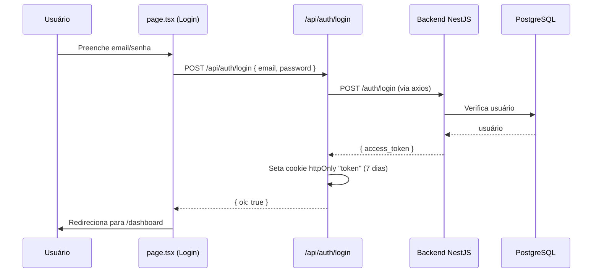
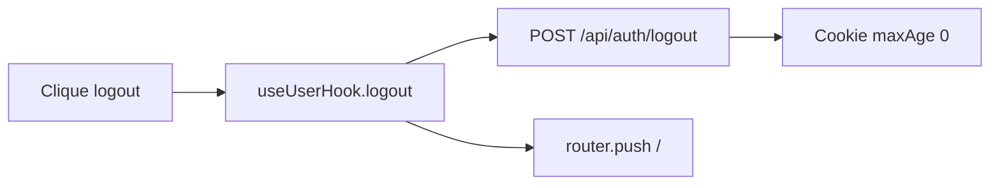
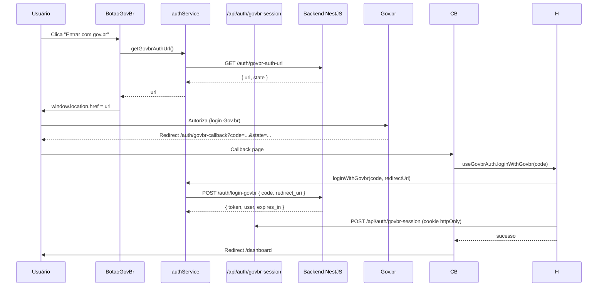

# Autenticação

Este documento descreve todos os fluxos de autenticação do frontend: login tradicional, sessão, logout, Gov.br e o proxy de proteção.

## Visão Geral

```mermaid
flowchart TB
    subgraph "Login Tradicional"
        A1[Página /: email + senha]
        A2[POST /api/auth/login]
        A3[Backend valida]
        A4[Cookie token httpOnly]
    end

    subgraph "Login Gov.br"
        B1[Botão Entrar com gov.br]
        B2[GET /auth/govbr-auth-url]
        B3[Redireciona p/ Gov.br]
        B4[Callback /auth/govbr-callback]
        B5[POST /auth/login-govbr]
        B6[POST /api/auth/govbr-session]
    end

    subgraph "Sessão"
        C1[SchoolContext → GET /api/auth/me]
        C2[Proxy valida cookie token (JWT)]
    end

    A1 --> A2 --> A3 --> A4
    B1 --> B2 --> B3 --> B4 --> B5 --> B6
    A4 --> C1
    A4 --> C2
    B6 --> C2
```

> ✅ **Sessão unificada (P2)**: login tradicional e Gov.br gravam o mesmo **cookie httpOnly** `token` (Gov.br via `POST /api/auth/govbr-session`); o proxy valida o JWT nas rotas protegidas. Detalhes em [problemas-conhecidos.md](../06-status/problemas-conhecidos.md).

## Fluxo de Login Tradicional (email/senha)



### Detalhes técnicos

- **Senha**: enviada em texto puro sob TLS; o backend valida com bcrypt (sem pré-hash no cliente desde o P3).
- **Rota**: `POST /api/auth/login` (`src/app/api/auth/login/route.ts`)
  - Proxy para `POST /auth/login` do backend
  - Extrai `access_token` e grava o cookie `token`
  - Cookie: `httpOnly`, `sameSite: strict`, `secure` em produção, `maxAge` 7 dias

## Sessão do Usuário (SchoolContext)

`src/contexts/SchoolContext.tsx` gerencia o estado global de sessão (busca `/api/auth/me` uma única vez). `src/user/useUserHook.tsx` foi mantido como wrapper deprecated que apenas delega ao contexto:

| Função | Descrição |
|--------|-----------|
| `user` | Dados do usuário (`UserData`: id, name, email, perfil/escola ativos, `schoolLinks`) ou `null` |
| `isLoading` | Indica se a busca de `/api/auth/me` está em andamento |
| `logout()` | Chama `POST /api/auth/logout` e redireciona para `/` |
| `refreshUserData()` | Re-executa `GET /api/auth/me` |

### `/api/auth/me` (`src/app/api/auth/me/route.ts`)

1. Lê o cookie `token` (se ausente → `401`)
2. Valida o JWT com `jose.jwtVerify` usando `SECRET` (fallback `'s0//P4$$w0rD'`)
3. Retorna `{ id, name, email, profileId, schoolId, schoolLinks }` — perfil/escola do vínculo ativo (prioriza aprovados) e todos os vínculos do usuário (`sub.upsUser`, com `networkId`)

## Logout



- `POST /api/auth/logout` (`src/app/api/auth/logout/route.ts`) limpa o cookie `token`
- O hook limpa `user` e navega para `/`

## Login Gov.br (OAuth2)

### Fluxo



### Componentes e hooks

| Peça | Arquivo | Papel |
|------|---------|-------|
| Botão | `src/components/BotaoGovBr.tsx` | Dispara o fluxo, redireciona para a URL do Gov.br |
| Hook | `src/hooks/useGovbrAuth.ts` | `loginWithGovbr(code)`, `logout()`; grava a sessão no cookie httpOnly via `POST /api/auth/govbr-session` |
| Página callback | `src/app/auth/govbr-callback/page.tsx` | Lê `code`/`error`, chama o hook, redireciona ao dashboard |
| Service | `src/services/auth.service.tsx` | `getGovbrAuthUrl()`, `loginWithGovbr(code, redirectUri)` |

### Sessão vs. login tradicional

Desde o P2 os dois fluxos são idênticos do ponto de vista de sessão: o JWT é gravado no mesmo cookie httpOnly `token` (Gov.br via `POST /api/auth/govbr-session`) e lido por `/api/auth/me`/`SchoolContext`. Não há mais diferença de token nem de dados do usuário.

## Proxy de Proteção (`src/proxy.ts`)

> Nota histórica: `src/middleware.ts` foi renomeado para `src/proxy.ts` no Next 16.

- Roda em todas as rotas, exceto `_next/*`, `favicon.ico`, `images` e `api/*`
- **Rotas públicas**: `/`, `/cadastro`, `/api/login`, `/api/auth/me`, `/api/auth/logout`, `/api/classes`
- Nas demais rotas: se o cookie `token` estiver ausente ou o JWT for inválido/expirado → redirect para `/`
- **Importante**: valida a assinatura e a expiração do JWT com `jose.jwtVerify`; token inválido também remove o cookie (P6)

## Guardas por Página

| Guarda | Arquivo | Regra |
|--------|---------|-------|
| Proxy global | `src/proxy.ts` | JWT válido no cookie `token` |
| Área master | `src/app/master/layout.tsx` | Sem sessão → `/`; `profileId !== PROFILE.MASTER` → `/dashboard` |
| Aulas / Minhas aulas | `src/app/classes/page.tsx`, `src/app/minhas-aulas/page.tsx` | Sem sessão → `/`; master é redirecionado para `/master` |