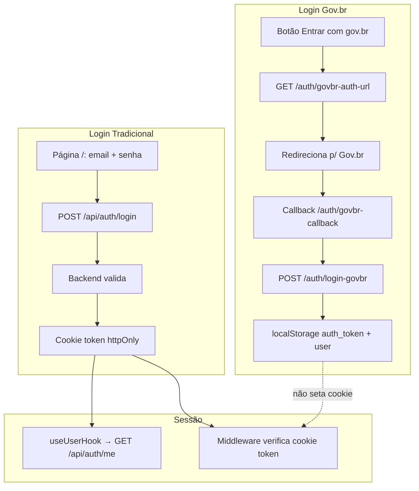
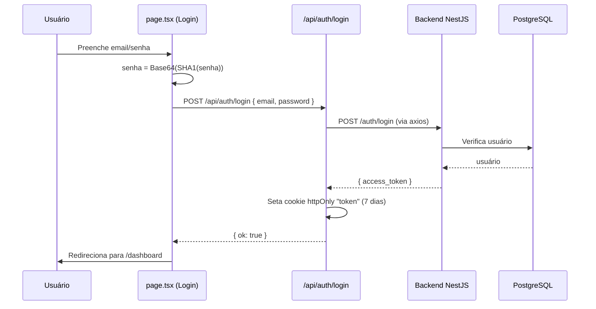
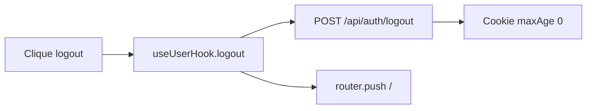
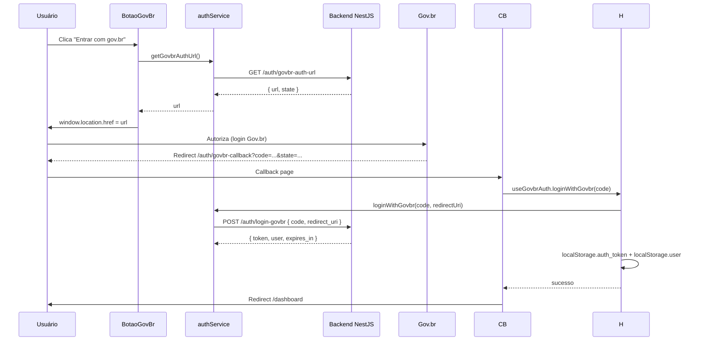

# Autenticação

Este documento descreve todos os fluxos de autenticação do frontend: login tradicional, sessão, logout, Gov.br e o middleware de proteção.

## Visão Geral

> ⚠️ **Inconsistência conhecida**: o login tradicional salva o token no **cookie httpOnly** `token`, enquanto o login Gov.br salva no **localStorage**. Como o middleware verifica apenas o cookie `token`, sessões iniciadas via Gov.br não são reconhecidas pelo middleware. Detalhes em [problemas-conhecidos.md](../06-status/problemas-conhecidos.md).

## Fluxo de Login Tradicional (email/senha)

### Detalhes técnicos

- **Hash da senha**: `Base64(SHA1(senha))` calculado no cliente (não é bcrypt).
- **Rota**: `POST /api/auth/login` (`src/app/api/auth/login/route.ts`)
  - Proxy para `POST /auth/login` do backend
  - Extrai `access_token` e grava o cookie `token`
  - Cookie: `httpOnly`, `sameSite: strict`, `secure` em produção, `maxAge` 7 dias

## Sessão do Usuário (useUserHook)

`src/user/useUserHook.tsx` gerencia o estado global de sessão:

| Função | Descrição |
|--------|-----------|
| `user` | Dados do usuário (`UserData`: id, name, email, profileId, schoolId) ou `null` |
| `isLoading` | Indica se a busca de `/api/auth/me` está em andamento |
| `logout()` | Chama `POST /api/auth/logout` e redireciona para `/` |
| `refreshUserData()` | Re-executa `GET /api/auth/me` |

### `/api/auth/me` (`src/app/api/auth/me/route.ts`)

1. Lê o cookie `token` (se ausente → `401`)
2. Valida o JWT com `jose.jwtVerify` usando `SECRET` (fallback `'s0//P4$$w0rD'`)
3. Retorna `{ id, name, email, profileId }` extraídos do payload (`sub` e `sub.upsUser[0]`)

## Logout

- `POST /api/auth/logout` (`src/app/api/auth/logout/route.ts`) limpa o cookie `token`
- O hook limpa `user` e navega para `/`

## Login Gov.br (OAuth2)

### Fluxo

### Componentes e hooks

| Peça | Arquivo | Papel |
|------|---------|-------|
| Botão | `src/components/BotaoGovBr.tsx` | Dispara o fluxo, redireciona para a URL do Gov.br |
| Hook | `src/hooks/useGovbrAuth.ts` | `loginWithGovbr(code)`, `logout()`; persiste token/user no localStorage |
| Página callback | `src/app/auth/govbr-callback/page.tsx` | Lê `code`/`error`, chama o hook, redireciona ao dashboard |
| Service | `src/services/auth.service.tsx` | `getGovbrAuthUrl()`, `loginWithGovbr(code, redirectUri)` |

### Diferenças vs. login tradicional

| Aspecto | Login tradicional | Login Gov.br |
|---------|-------------------|--------------|
| Token | cookie httpOnly `token` | `localStorage` (`auth_token`) |
| Dados do usuário | via `/api/auth/me` (cookie) | `localStorage` (`user`) |
| Reconhecido pelo middleware? | Sim | **Não** |

## Middleware de Proteção (`src/middleware.ts`)

- Roda em todas as rotas, exceto `_next/*`, `favicon.ico`, `images` e `api/*`
- **Rotas públicas**: `/`, `/cadastro`, `/api/login`, `/api/auth/me`, `/api/auth/logout`, `/api/classes`
- Nas demais rotas: se o cookie `token` estiver ausente → redirect para `/`
- **Importante**: o middleware verifica apenas a **presença** do cookie, não a validade do JWT

## Guardas por Página

| Guarda | Arquivo | Regra |
|--------|---------|-------|
| Middleware global | `src/middleware.ts` | Cookie `token` presente |
| Área master | `src/app/master/layout.tsx` | `profileId === 1` |
| Aulas / Minhas aulas | `src/app/classes/page.tsx`, `src/app/minhas-aulas/page.tsx` | Usuário autenticado; master é redirecionado para `/master` |