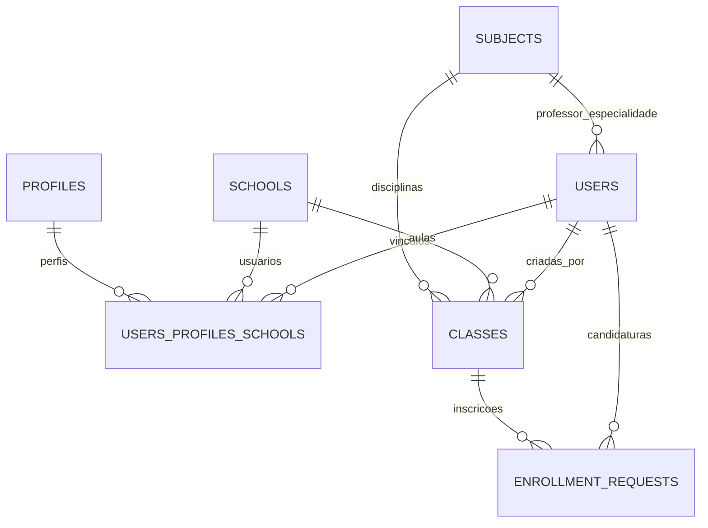
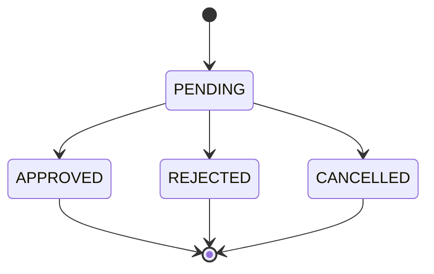

# Modelo de Dados (visão do frontend)

Este documento descreve as entidades do sistema **na perspectiva do frontend** (tipos e payloads usados pelo código). O modelo físico completo (Prisma/PostgreSQL) vive no backend.

## Diagrama de Entidades

## Entidades (como vistas pelo frontend)

### User (`src/types/master.ts`, `src/user/user.types.tsx`)

| Campo | Tipo | Descrição |
|-------|------|-----------|
| `id` | number \| string | PK |
| `name` | string | Nome completo |
| `email` | string | Email único |
| `phone` | string \| null | Telefone |
| `schoolId` | number \| null | FK da escola vinculada |
| `profileId` | number | Perfil (1-4) |
| `substitutionLimitPerSemester` | number \| null | Teto de substituições do usuário |
| `createdAt` | string | Data de criação |

> O `UserData` da sessão (`src/user/user.types.tsx`) expõe apenas `{ id, name, email, profileId, schoolId }`.

### School (`src/types/master.ts`)

| Campo | Tipo | Descrição |
|-------|------|-----------|
| `id` | number | PK |
| `name` | string | Nome da escola (único) |
| `substitutionLimitPerSemester` | number \| null | Limite padrão de substituições da escola |
| `createdAt` | string | Data de criação |

### Profile

| Campo | Tipo |
|-------|------|
| `id` | number (1-4) |
| `name` | string |
| `description` | string |

Perfis: 1 = DIRETOR, 2 = AUXILIAR_ADMIN, 3 = PROFESSOR, 4 = MASTER (valor real do backend, espelhado em `src/constants/profile.ts`; ver [perfis-e-permissoes.md](../01-visao-geral/perfis-e-permissoes.md)).

### Subject (`src/types/teacher.ts`)

| Campo | Tipo |
|-------|------|
| `id` | number \| string |
| `name` | string |
| `description` | string (opcional) |

### Class (Aula) (`src/types/enrollment.ts`)

| Campo | Tipo | Descrição |
|-------|------|-----------|
| `id` | number | PK |
| `schoolId` | number | FK da escola |
| `subjectId` | number | FK da disciplina |
| `subjectName` | string | Nome da disciplina (embedded) |
| `date` | string | Data (alternativa a `statededAt`) |
| `statededAt` | string | Início (nome incorreto persistido na API) |
| `finishedAt` | string | Término |
| `available` | boolean | Disponível para candidatura |
| `enrolledById` | number | Professor que preencheu |

### EnrollmentRequest (Candidatura) (`src/types/enrollment.ts`)

| Campo | Tipo | Descrição |
|-------|------|-----------|
| `id` | number \| string | PK |
| `classId` | number | FK da aula |
| `userId` / `professorId` | number \| string | Professor candidato |
| `status` | enum | `PENDING` \| `APPROVED` \| `REJECTED` \| `CANCELLED` |
| `rejectionReason` | string \| null | Motivo da rejeição |
| `createdAt` | string | Data da candidatura |
| `updatedAt` | string | Última atualização |

### Teacher (visão do `teacher.service`) (`src/types/teacher.ts`)

| Campo | Tipo |
|-------|------|
| `id` | string |
| `name` | string |
| `email` | string |
| `schoolId` | string \| null |
| `profileId` | number |
| `subject` | Subject \| null |
| `totalSubstitutions` | number |

### DashboardStats (`src/types/master.ts`)

| Campo | Tipo |
|-------|------|
| `totalSchools` | number |
| `totalClassesAvailable` | number |
| `totalSubstitutionsThisMonth` | number |

## Estados de Candidatura

## Relacionamentos Chave

- **Usuário ↔ Escola**: vínculo N:N via `UsersProfilesSchools` (um usuário pode pertencer a várias escolas/perfis)
- **Aula ↔ Disciplina**: N:1 (uma aula tem uma disciplina)
- **Aula ↔ Escola**: N:1
- **Candidatura ↔ Aula**: N:1
- **Candidatura ↔ Usuário**: N:1
- **Professor (user) ↔ Disciplina (subjectId)**: especialidade do professor

## Limite de Substituições (semestre)

- Fonte: `GET /users/:id` → `substitutionLimitPerSemester`
- Contagem: `GET /enrollment-requests?userId=&status=APPROVED&createdAfter=<início do semestre>`
- Janelas de semestre: `01/01` (jan–jun) ou `01/07` (jul–dez), calculadas em `useSubstitutionLimit.ts`

## Inconsistências de Modelo Conhecidas

> **Atualização (P7/P1):** os itens 1, 3 e 4 abaixo foram corrigidos na rodada de correção de tipos — o mapeamento de `profileId` é único (`src/constants/profile.ts`), os ids são `number` em todos os tipos e `Class.date` foi removido (só `statededAt`, campo real da API). O item 2 (`statededAt` como typo persistido) permanece por ser contrato do backend. Mantidos como registro histórico.

1. **`profileId` divergente**: legado vs. módulo master (1=admin vs. 1=master, 3=professor vs. 4=professor)
2. **`statededAt`**: nome de campo incorreto persistido na API (typo que virou contrato)
3. **`id` heterogêneo**: `number` em alguns tipos (`enrollment.ts`, `master.ts`) vs. `string` em outros (`teacher.ts`)
4. **`Class.date` vs `statededAt`**: a página `/classes` usa `(classItem as any).statededAt || classItem.date`

Ver [problemas-conhecidos.md](../06-status/problemas-conhecidos.md) para o contexto completo.