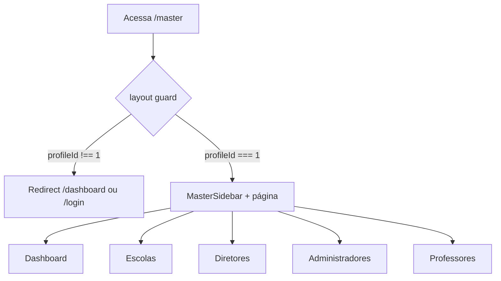

# Módulo: Área Master (Administrativa)

A área master é o painel de administração global, acessível apenas pelo perfil **Master** (`profileId === 1`).

## Estrutura de Rotas

```
/master/
├── layout.tsx            # Guard de acesso + sidebar + header
├── page.tsx              # Redireciona para /master/dashboard
├── dashboard/            # Estatísticas
├── escolas/              # CRUD de escolas
├── diretores/            # Gestão de diretores
├── administradores/      # Gestão de administradores
└── professores/          # Gestão de professores + candidaturas
```

## Layout e Guarda (`src/app/master/layout.tsx`)

- Renderiza `MasterSidebar` + `MasterHeader` + children
- Se `user.profileId !== 1`:
  - Sem usuário → redirect `/login`
  - Perfil errado → redirect `/dashboard`

## Páginas

### Dashboard (`/master/dashboard`)

- Exibe `StatCard`s com métricas via `useMasterDashboard`
- Métricas (`DashboardStats`):
  - Total de escolas (`GET /schools`)
  - Aulas disponíveis (`GET /classes?available=true`)
  - Substituições do mês (`GET /enrollment-requests?status=APPROVED` filtrado pelo mês atual)

### Escolas (`/master/escolas`)

- Tabela: ID, nome, limite de substituições por semestre, data de criação
- Ações: criar (modal `SchoolForm`), editar, excluir (`ConfirmModal`)
- Hook: `useSchools` → `masterService` (getSchools, createSchool, updateSchool, deleteSchool)

### Diretores (`/master/diretores`)

- Lista via `useUsers(2)` → `GET /users?profileId=2`
- Ações: criar (modal `UserForm`), "Desvincular" (unlink — seta `schoolId: null`)
- Tabela: ID, nome, email, telefone, escola

### Administradores (`/master/administradores`)

- Lista via `useUsers(3)` → `GET /users?profileId=3`
- Mesmas ações e modal `UserForm`

### Professores (`/master/professores`)

Duas abas:

1. **Professores**: professores vinculados à escola (`useTeachers` com `schoolId` fixo `'school-1'` — TODO no código)
   - Vincular/desvincular professores (`teacherService.linkTeacher/unlinkTeacher`)
2. **Candidaturas**: enrollment requests filtradas por status
   - Aprovar/rejeitar (`teacherService.updateEnrollmentStatus`)

## Formulários

| Componente | Arquivo | Campos |
|------------|---------|--------|
| `SchoolForm` | `src/app/master/escolas/components/SchoolForm.tsx` | nome (obrigatório), `substitutionLimitPerSemester` (opcional) |
| `UserForm` | `src/app/master/{diretores,administradores}/components/UserForm.tsx` | nome, email, telefone (opcional), escola (obrigatório) |

## Hooks e Serviços

| Recurso | Arquivo |
|---------|---------|
| `useMasterDashboard` | `src/hooks/useMasterDashboard.ts` |
| `useSchools` | `src/hooks/useSchools.ts` |
| `useUsers` | `src/hooks/useUsers.ts` |
| `useTeachers` | `src/hooks/useTeachers.ts` |
| `masterService` | `src/services/master.service.tsx` |
| `teacherService` | `src/services/teacher.service.tsx` |

## Diagrama de Acesso



## Pontos de Atenção

1. **`schoolId` hardcoded** em `/master/professores` (`'school-1'`), com TODO para vir da sessão.
2. **Dois `UserForm` idênticos** duplicados (diretores e administradores) — candidato a refatoração.
3. **`MasterHeader` não é importado** por nenhuma página — somente o `MasterSidebar` é usado no layout.
4. **Mapeamento de perfis novo**: `1` = master, `2` = diretor, `3` = administrador, `4` = professor (diverge do dashboard legado).