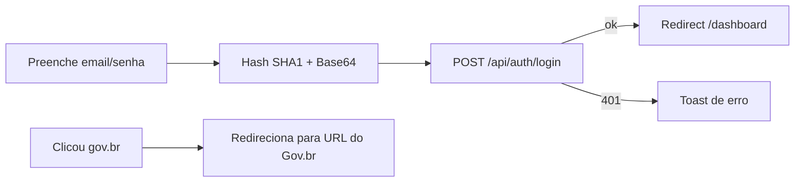

# Módulo: Autenticação

Este módulo cobre as páginas e fluxos de autenticação: login, cadastro e callback do Gov.br.

## Páginas

| Rota | Arquivo | Descrição |
|------|---------|-----------|
| `/` | `src/app/page.tsx` | Página de login (email/senha) + botão Gov.br + link para cadastro |
| `/cadastro` | `src/app/cadastro/page.tsx` | Auto-cadastro de professor |
| `/auth/govbr-callback` | `src/app/auth/govbr-callback/page.tsx` | Callback OAuth2 do Gov.br |

## Login (`/`)

- Layout de duas colunas com marca (logo) e formulário de credenciais
- Campos: email e senha
- A senha é enviada como `Base64(SHA1(senha))`
- Chamada: `POST /api/auth/login` (via `fetch`, não axios)
- Sucesso → redireciona para `/dashboard`
- Componente `BotaoGovBr` dispara o fluxo Gov.br
- Link para `/cadastro`

### Fluxo

## Cadastro (`/cadastro`)

- Formulário: nome, email, telefone, senha, confirmar senha (validação Yup)
- Envia diretamente ao backend: `api.post('/users', { name, email, phone, password, profileId: 3, schoolId: 1 })`
- ⚠️ **Hardcoded**: `profileId: 3` e `schoolId: 1` são fixos no código (professor da escola 1)
- Sucesso → toast + redireciona para `/`

## Callback Gov.br (`/auth/govbr-callback`)

- Lê `code`/`error` da query string
- Chama `useGovbrAuth.loginWithGovbr(code)`
- Estados: loading, sucesso, erro
- Sucesso → redireciona para `/dashboard` após ~1.5s
- Persiste `auth_token` e `user` no `localStorage`

## Código Relacionado

| Peça | Arquivo |
|------|---------|
| Botão Gov.br | `src/components/BotaoGovBr.tsx` |
| Hook Gov.br | `src/hooks/useGovbrAuth.ts` |
| Service auth | `src/services/auth.service.tsx` |
| Hook de sessão | `src/user/useUserHook.tsx` |
| API Routes | `src/app/api/auth/login`, `logout`, `me` |

## Pontos de Atenção

1. **Inconsistência de sessão Gov.br**: token vai para localStorage, não para o cookie `token` → o middleware não reconhece sessões Gov.br (ver [autenticacao.md](../03-arquitetura/autenticacao.md)).
2. **Cadastro hardcoded**: `profileId: 3` / `schoolId: 1` fixos.
3. **Hash SHA1**: não é bcrypt; vulnerabilidade conhecida (ver [problemas-conhecidos.md](../06-status/problemas-conhecidos.md)).