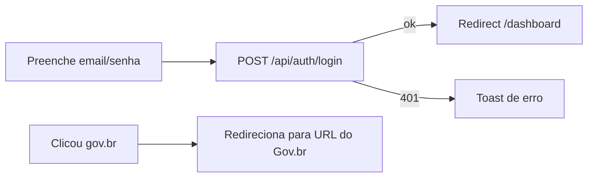

# Módulo: Autenticação

Este módulo cobre as páginas e fluxos de autenticação: login, cadastro e callback do Gov.br.

## Páginas

| Rota | Arquivo | Descrição |
|------|---------|-----------|
| `/` | `src/app/page.tsx` | Página de login (email/senha) + botão Gov.br + link para cadastro |
| `/cadastro` | `src/app/cadastro/page.tsx` | Auto-cadastro de professor |
| `/auth/govbr-callback` | `src/app/auth/govbr-callback/page.tsx` | Callback OAuth2 do Gov.br |

## Login (`/`)

- Layout de duas colunas com marca (logo) e formulário de credenciais
- Campos: email e senha
- A senha é enviada em texto puro sob TLS (sem pré-hash no cliente desde o P3)
- Chamada: `POST /api/auth/login` (via `fetch`, não axios)
- Sucesso → redireciona para `/dashboard`
- Componente `BotaoGovBr` dispara o fluxo Gov.br
- Link para `/cadastro`

### Fluxo

## Cadastro (`/cadastro`)

- Formulário: nome, email, telefone, senha, confirmar senha (validação Yup)
- Envia via `api-client.service` (proxy `/api/proxy`): `POST /users` com nome, email, telefone e senha (sem `profileId`/`schoolId` — P4)
- O vínculo escola/perfil é criado depois, por quem tem permissão (`assign-profile`)
- Sucesso → toast + redireciona para `/`

## Callback Gov.br (`/auth/govbr-callback`)

- Lê `code`/`error` da query string
- Chama `useGovbrAuth.loginWithGovbr(code)`
- Estados: loading, sucesso, erro
- Sucesso → redireciona para `/dashboard` após ~1.5s
- Sessão gravada no cookie httpOnly via `POST /api/auth/govbr-session`

## Código Relacionado

| Peça | Arquivo |
|------|---------|
| Botão Gov.br | `src/components/BotaoGovBr.tsx` |
| Hook Gov.br | `src/hooks/useGovbrAuth.ts` |
| Service auth | `src/services/auth.service.tsx` |
| Hook de sessão | `src/user/useUserHook.tsx` |
| API Routes | `src/app/api/auth/login`, `logout`, `me`, `govbr-session` |

## Pontos de Atenção (resolvidos)

1. **Sessão Gov.br** (P2): o token agora vai para o mesmo cookie httpOnly `token` via `POST /api/auth/govbr-session`; reconhecido pelo proxy.
2. **Cadastro hardcoded** (P4): `profileId`/`schoolId` removidos do payload.
3. **Hash SHA1** (P3): o frontend não pré-hasheia mais a senha; o backend usa bcrypt.