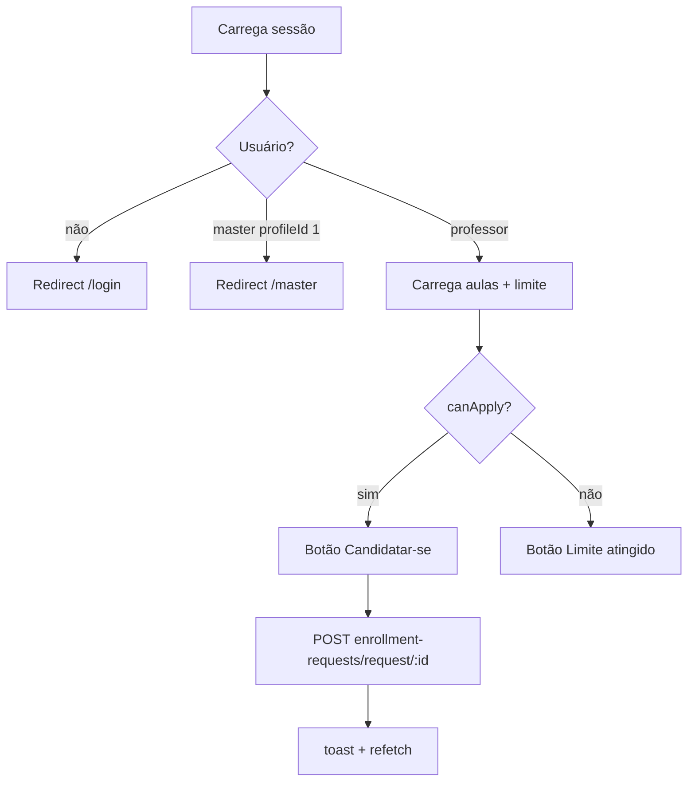
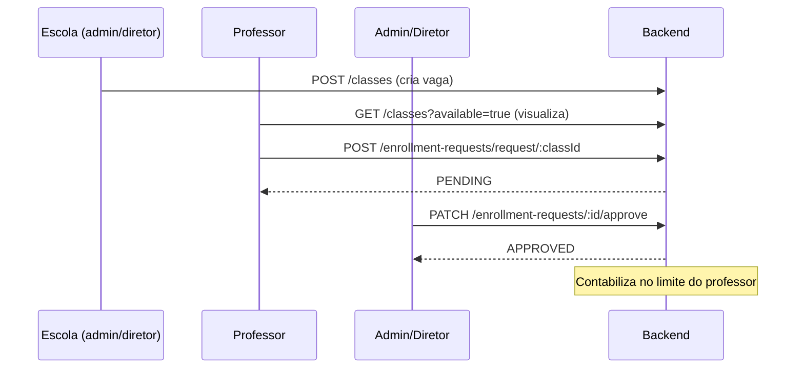

# Módulo: Dashboard, Aulas e Candidaturas

Este módulo cobre a gestão de aulas vagas e candidaturas para diretores, administradores e professores.

## Páginas

| Rota | Arquivo | Público |
|------|---------|---------|
| `/dashboard` | `src/app/dashboard/page.tsx` | Dashboard legado (admin/diretor/professor) |
| `/classes` | `src/app/classes/page.tsx` | Aulas disponíveis (professor) |
| `/minhas-aulas` | `src/app/minhas-aulas/page.tsx` | Minhas candidaturas (professor) |

## Dashboard Legado (`/dashboard`)

Página principal antiga, com:

- **Header**: logo, nome do usuário, logout, `SubstitutionCounter` (somente `profileId 3` no mapeamento legado = professor)
- **Abas**:
  - "Aulas Disponíveis"
  - "Minhas Aulas" / "Aulas aceitas"
  - "Candidaturas" (para perfis 1 e 2 legados = admin/diretor)
- **Criação de aula vaga** (admin/diretor):
  - Formulário com `schoolId` (select para admin, fixo para diretor), `subjectId`, horários
  - POST direto no backend (`api.post('/classes', ...)`)
- **Listagem**: busca em `/api/classes` (proxy Next.js)
- **Ações**:
  - Professor se candidata: `POST /enrollment-requests/request/:id`
  - Admin/diretor deleta aula: `DELETE /api/classes/:id`
- **Filtro**: busca por disciplina/nome de escola

## Aulas Disponíveis (`/classes`)

Interface mais nova em grade de cards. Usa hooks:

- `useUserHook` → sessão
- `useEnrollments` → lista de aulas (`GET /classes?available=true`)
- `useEnrollmentMutations` → `createEnrollment({ classId })`
- `useSubstitutionLimit(user?.id)` → bloqueio por limite

### Comportamento

- Card mostra disciplina, data (`statededAt`/`date`) e botão de candidatura
- Botão desabilitado quando `!available || !canApply`

## Minhas Aulas (`/minhas-aulas`)

Tabela das candidaturas do professor com filtros por status:

- Abas: Todas, Pendentes, Aprovadas, Rejeitadas, Canceladas
- `useEnrollments({ userId: Number(user.id) })`
- `useEnrollmentMutations.cancelEnrollment` — somente candidaturas `PENDING`
- Colunas: ID da aula, status (badge colorido), data da candidatura, motivo da rejeição, ação

### Badges de status

| Status | Cor |
|--------|-----|
| PENDING | Amarelo |
| APPROVED | Verde |
| REJECTED | Vermelho |
| CANCELLED | Cinza |

## Candidaturas (gestão por admin/diretor)

- No dashboard legado: aba "Candidaturas" para perfis admin/diretor
- Componente `EnrollmentsList` (`src/components/EnrollmentsList.tsx`):
  - Filtros: Pendentes/Aprovadas/Rejeitadas
  - Ações: aprovar, rejeitar (com motivo)
  - Usa `useEnrollments` + `useEnrollmentMutations`

## Hooks e Serviços Utilizados

| Recurso | Arquivo |
|---------|---------|
| `useEnrollments` | `src/hooks/useEnrollments.ts` |
| `useEnrollmentMutations` | `src/hooks/useEnrollment.ts` |
| `useSubstitutionLimit` | `src/hooks/useSubstitutionLimit.ts` |
| `EnrollmentsList` | `src/components/EnrollmentsList.tsx` |
| `SubstitutionCounter` | `src/components/SubstitutionCounter.tsx` |
| `enrollmentService` | `src/services/enrollment.service.tsx` |

## Fluxo Completo de uma Substituição

## Pontos de Atenção

1. **Dois mapeamentos de profileId**: o dashboard legado trata `3` como professor; as páginas novas tratam `4` como professor e redirecionam master (`1`) para `/master`.
2. **Rota `/login` não existe**: as páginas novas redirecionam para `/login`, mas o formulário de login vive em `/`.
3. **Criação de aula sem proxy**: o dashboard cria aulas direto no backend, enquanto a listagem usa o proxy `/api/classes`.