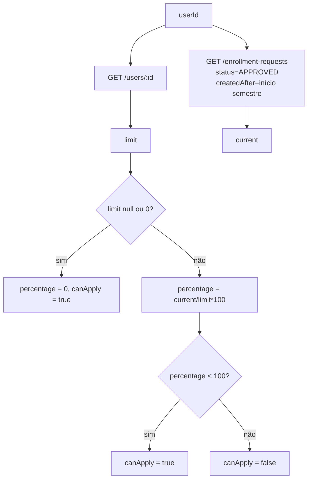

# Módulo: Limite de Substituições

O limite de substituições (teto por semestre) controla quantas aulas aprovadas um professor pode assumir em um semestre.

## Objetivo

- Limitar a quantidade de substituições por professor por semestre
- Bloquear novas candidaturas quando o limite é atingido
- Exibir o saldo/percentual ao professor

## Fonte de Dados

| Dado | Endpoint |
|------|----------|
| Limite do professor | `GET /users/:id` → `substitutionLimitPerSemester` |
| Substituições aprovadas | `GET /enrollment-requests?userId=&status=APPROVED&createdAfter=<início do semestre>` |

## Hook `useSubstitutionLimit` (`src/hooks/useSubstitutionLimit.ts`)

### Semestre corrente

```ts
const getCurrentSemester = (): string => {
  const now = new Date();
  const year = now.getFullYear();
  const month = now.getMonth();
  if (month < 6) return `${year}-01-01`;
  return `${year}-07-01`;
};
```

- Janeiro–junho → início em `01/01`
- Julho–dezembro → início em `01/07`

### Retorno

| Campo | Tipo | Descrição |
|-------|------|-----------|
| `current` | number | Nº de candidaturas aprovadas no semestre |
| `limit` | number \| null | Limite do professor (`null` = sem restrição) |
| `percentage` | number | `round(current / limit * 100)` (0 se `limit` nulo/zero) |
| `canApply` | boolean | `true` se `limit === null` ou `percentage < 100` |
| `loading` | boolean | Estado de carregamento |
| `error` | string \| null | Mensagem de erro |

## Cálculo



## Uso no Frontend

### Página `/classes`

- `useSubstitutionLimit(user?.id)` → `canApply`, `limit`, `current`, `percentage`
- Botão "Candidatar-se" fica desabilitado quando `!canApply`
- O texto do botão muda para **"Limite atingido"**
- Ao tentar candidatar com limite atingido, exibe toast de erro

### Dashboard legado

- `SubstitutionCounter` exibe o contador visual (apenas `profileId 3` no mapeamento legado)

## Componente `SubstitutionCounter` (`src/components/SubstitutionCounter.tsx`)

| Prop | Tipo | Descrição |
|------|------|-----------|
| `current` | number | Substituições atuais |
| `limit` | number \| null | Limite |
| `percentage` | number | Percentual |
| `loading` | boolean | Estado de carregamento |

### Cores por faixa

| Faixa | Cor | Significado |
|-------|-----|-------------|
| `< 80%` | Verde | OK |
| `>= 80%` | Amarelo | Aviso |
| `>= 100%` | Vermelho | Bloqueado |

## Regras de Negócio

1. `limit === null` → sem restrição (`canApply = true`)
2. `percentage >= 100` → bloqueado (`canApply = false`)
3. O backend também valida o limite ao processar a candidatura (validação de segurança)

## Pontos de Atenção

1. O cálculo do semestre é feito **client-side** — depende do relógio do navegador.
2. O backend é a fonte de verdade; o bloqueio no frontend é apenas UX.
3. `limit` vem do usuário (`substitutionLimitPerSemester`); o `SchoolForm` da área master permite definir o limite da escola — a relação exata usuário↔escola no cálculo é dependente do backend.