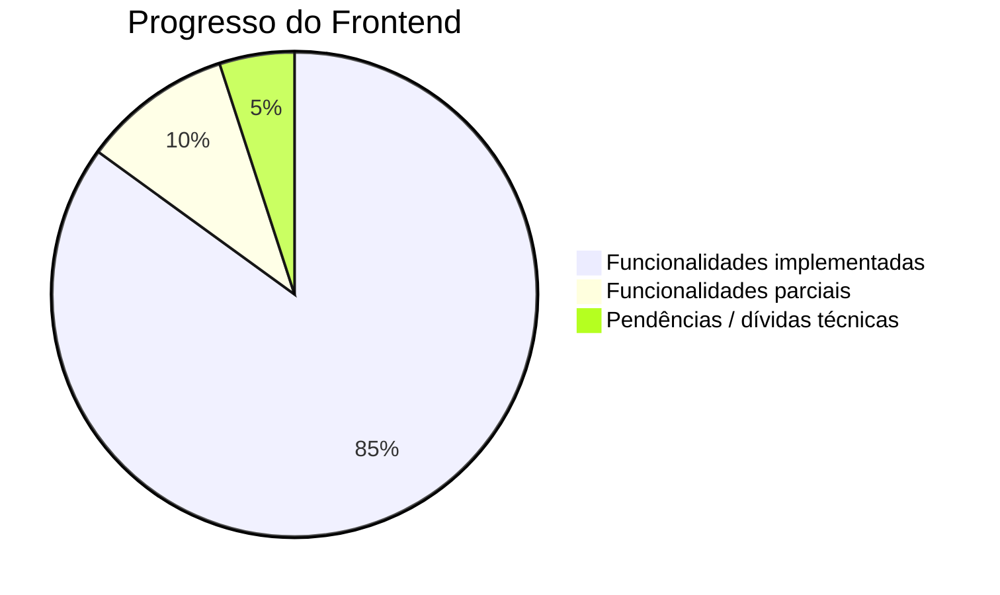

# Estado Atual do Projeto

## Visão Geral

O frontend Troca-Aula tem a maioria das funcionalidades principais implementadas; as pendências restantes estão concentradas em cobertura de testes (P12) e na migração das telas antigas para a infraestrutura de UI (P13 — tema, `AdminTable`, `Skeleton` e `ErrorBoundary` já existem).

## Funcionalidades Implementadas

### ✅ Autenticação
| Funcionalidade | Status | Observações |
|----------------|--------|-------------|
| Login com email/senha | ✅ Completo | Senha enviada em texto puro sob TLS (sem pré-hash no cliente, P3); cookie httpOnly |
| Cadastro de usuários | ✅ Completo | Validação Yup; sem `profileId`/`schoolId` no payload (P4) |
| Logout | ✅ Completo | Limpa cookie + estado |
| Sessão com cookies | ✅ Completo | `SchoolContext` + `/api/auth/me` |
| Proxy de proteção | ✅ Completo | Valida assinatura/expiração do JWT (`jose.jwtVerify`); ausente ou inválido → `/` (P6) |
| Login Gov.br | ✅ Completo | Mesmo cookie httpOnly via `POST /api/auth/govbr-session` (P2) |
| Alteração de senha | ✅ Completo | `/alterar-senha` (`PATCH /auth/change-password`); reset pelo Master via `POST /users/:id/reset-password` |

### ✅ Gestão de Aulas e Candidaturas
| Funcionalidade | Status |
|----------------|--------|
| Criar aula vaga (dashboard) | ✅ Completo |
| Listar aulas disponíveis | ✅ Completo (matéria + janela de prioridade aplicadas pelo servidor, P16) |
| Candidatar-se a aula (`/classes`) | ✅ Completo |
| Minhas candidaturas (`/minhas-aulas`) | ✅ Completo |
| Aprovar/rejeitar candidaturas | ✅ Completo |
| Cancelar candidatura | ✅ Completo |
| Excluir aula | ✅ Completo |
| Busca/filtro de aulas | ✅ Completo |
| Limite de substituições por semestre | ✅ Completo (cálculo no servidor, P14) |
| Notificações in-app | ✅ Completo (novas vagas, aprovação/rejeição e candidaturas pendentes) |

### ✅ Área Master (Administrativa)
| Funcionalidade | Status |
|----------------|--------|
| Dashboard com estatísticas | ✅ Completo |
| CRUD de escolas | ✅ Completo |
| Gestão de diretores | ✅ Completo |
| Gestão de administradores | ✅ Completo |
| Gestão de professores + candidaturas | ✅ Completo (vínculo via `assign-profile`, sem escola hardcoded — P4/P15) |
| Auditoria por rede | ✅ Completo (`/master/auditoria`) |
| Redefinir senha de usuário | ✅ Completo |
| Guard de acesso por perfil | ✅ Completo |

### ✅ Interface
| Funcionalidade | Status |
|----------------|--------|
| Páginas de login/cadastro | ✅ Completo |
| Dashboard legado | ✅ Completo |
| Página de aulas disponíveis | ✅ Completo |
| Página minhas aulas | ✅ Completo |
| Minha jornada do professor | ✅ Completo (`/minha-jornada`, `GET /teacher-workload-records/me`) |
| Indicadores da escola | ✅ Completo (`/escola/indicadores`: coverage-stats + histórico + CSV/impressão) |
| Sidebar/header da área master | ✅ Completo (`MasterHeader` com nome real e sino) |
| Notificações toast | ✅ Completo |
| Notificações in-app | ✅ Completo (`NotificationBell` + `useNotifications`) |
| Loading e erros padronizados | ✅ Completo (`Skeleton` nas telas novas + `ErrorBoundary` global no layout) |
| Logo customizado | ✅ Completo |

## Métricas do Código

| Métrica | Valor aproximado |
|---------|------------------|
| Páginas/rotas (App Router) | 20 (19 telas + redirect de `/master`) |
| Componentes compartilhados | ~11 |
| Hooks | ~19 |
| Services | 10 |
| API Routes (proxy) | 7 |
| Tipos TypeScript | ~20 interfaces |

## Testes

| Área | Status |
|------|--------|
| Suíte completa | ✅ 619/619 testes em 84 arquivos (cobertura ≥ 92,8% em todas as métricas; mínimo de 90% no CI) |
| Páginas cobertas | login/cadastro, dashboard legado, `/classes`, `/minhas-aulas`, `/alterar-senha`, `/master/{auditoria,dashboard,redes,diretores,administradores,escolas,professores,politicas-carga-horaria}`, `/minha-jornada`, `/escola/{indicadores,prioridade,fechamento-ponto,jornada-docente}`, `/minhas-preferencias` |
| Hooks/contextos cobertos | `SchoolContext`, `useUserHook`, `useNotifications`, `useGovbrAuth`, `useSubstitutionLimit`, `useSchools`, `useUsers`, `useTeachers`, `useEnrollments`, `useEnrollment`, `useMasterDashboard`, `useSubjects`, hooks de relatórios/fechamento/eligibility |
| Services cobertos | `auth`, `classes`, `enrollment`, `teacher`, `master`, `eligibility`, `account`, `indicators` |
| Pendentes | páginas master restantes (`diretores`, `administradores`, `escolas`, `professores`, `políticas-carga-horaria`), fluxos de escola (`fechamento-ponto`, `jornada-docente`) e hooks `useMaster` (P12) |
| Cobertura | Parcial (configurado para 100% nas pastas cobertas) |

## Dependências Principais

- next: 16.3.6
- react / react-dom: 19.3.0
- styled-components: 6.1.18
- axios: 1.9.0
- react-hook-form: 7.56.4 / yup: 1.6.1
- vitest: 4.1.2
- jose: 6.0.11
- msw: 2.12.14

## Links Úteis

- **Frontend**: https://github.com/TROCA-AULA/troca-aula-front
- **Backend**: https://github.com/TROCA-AULA/troca-aula-backend
- **Especificações (specs)**: `specs/001` a `specs/007` no repositório

## Próximos Passos Imediatos

1. Testes das páginas master restantes, dos fluxos de escola, do service `master` e dos hooks pendentes (P12)
2. Migrar as telas antigas para o tema/`AdminTable`/`Skeleton` (P13)
3. Notificações por e-mail/push (o in-app já está entregue)
4. Exportação em PDF nativo (CSV/impressão já entregues)
5. App mobile e integração IoT (longo prazo)

Mais detalhes em [roadmap.md](./roadmap.md) e [problemas-conhecidos.md](./problemas-conhecidos.md).
