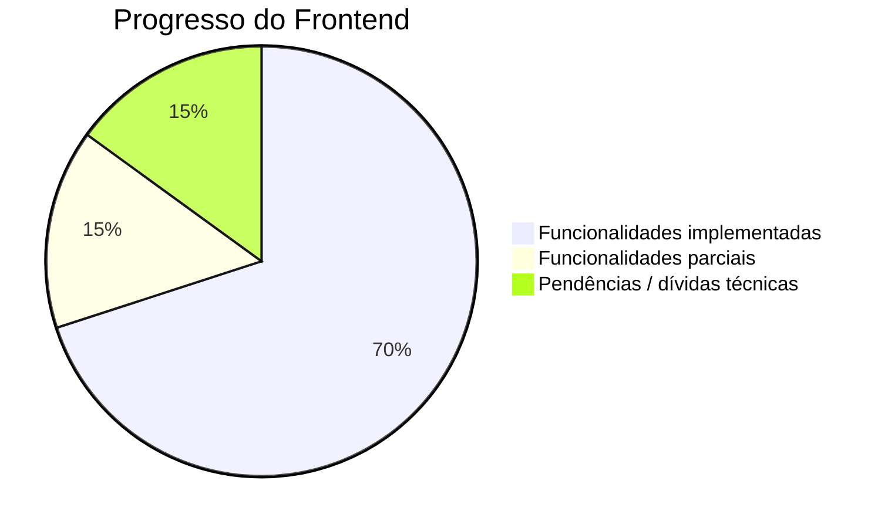

# Estado Atual do Projeto

## Visão Geral

O frontend Troca-Aula tem a maioria das funcionalidades principais implementadas, com algumas pendências conhecidas.

## Funcionalidades Implementadas

### ✅ Autenticação
| Funcionalidade | Status | Observações |
|----------------|--------|-------------|
| Login com email/senha | ✅ Completo | Hash SHA1+Base64 no cliente, cookie httpOnly |
| Cadastro de usuários | ✅ Completo | Validação Yup; `profileId: 3`, `schoolId: 1` hardcoded |
| Logout | ✅ Completo | Limpa cookie + estado |
| Sessão com cookies | ✅ Completo | `useUserHook` + `/api/auth/me` |
| Middleware de proteção | ✅ Completo | Verifica cookie `token` |
| Login Gov.br | ⚠️ Parcial | Funciona, mas sessão divergente (localStorage) |

### ✅ Gestão de Aulas e Candidaturas
| Funcionalidade | Status |
|----------------|--------|
| Criar aula vaga (dashboard) | ✅ Completo |
| Listar aulas disponíveis | ✅ Completo |
| Candidatar-se a aula (`/classes`) | ✅ Completo |
| Minhas candidaturas (`/minhas-aulas`) | ✅ Completo |
| Aprovar/rejeitar candidaturas | ✅ Completo |
| Cancelar candidatura | ✅ Completo |
| Excluir aula | ✅ Completo |
| Busca/filtro de aulas | ✅ Completo |
| Limite de substituições por semestre | ✅ Completo |

### ✅ Área Master (Administrativa)
| Funcionalidade | Status |
|----------------|--------|
| Dashboard com estatísticas | ✅ Completo |
| CRUD de escolas | ✅ Completo |
| Gestão de diretores | ✅ Completo |
| Gestão de administradores | ✅ Completo |
| Gestão de professores + candidaturas | ⚠️ Parcial (`schoolId` hardcoded `'school-1'`) |
| Guard de acesso por perfil | ✅ Completo |

### ✅ Interface
| Funcionalidade | Status |
|----------------|--------|
| Páginas de login/cadastro | ✅ Completo |
| Dashboard legado | ✅ Completo |
| Página de aulas disponíveis | ✅ Completo |
| Página minhas aulas | ✅ Completo |
| Sidebar/header da área master | ✅ Completo |
| Notificações toast | ✅ Completo |
| Logo customizado | ✅ Completo |

## Métricas do Código

| Métrica | Valor aproximado |
|---------|------------------|
| Páginas/rotas (App Router) | ~12 |
| Componentes compartilhados | ~6 |
| Hooks | ~10 |
| Services | 4 |
| API Routes (proxy) | 6 |
| Tipos TypeScript | ~20 interfaces |

## Testes

| Área | Status |
|------|--------|
| Testes unitários | Parciais (pages, middleware, api.service, useUserHook, Logo) |
| Testes de componentes novos (`/classes`, `/minhas-aulas`) | Pendentes |
| Testes dos services | Pendentes |
| Cobertura | Parcial (configurado para 100% nas pastas cobertas) |

## Dependências Principais

- next: 15.3.2
- react: 19.0.0
- styled-components: 6.1.18
- axios: 1.9.0
- react-hook-form: 7.56.4 / yup: 1.6.1
- vitest: 4.1.2
- jose: 6.0.11

## Links Úteis

- **Frontend**: https://github.com/TROCA-AULA/troca-aula-front
- **Backend**: https://github.com/TROCA-AULA/troca-aula-backend
- **Especificações (specs)**: `specs/001` a `specs/007` no repositório

## Próximos Passos Imediatos

1. Unificar os dois mapeamentos de `profileId` (legado vs. novo)
2. Corrigir a sessão Gov.br (unificar cookie/localStorage)
3. Remover valores hardcoded (`schoolId`, `profileId` do cadastro)
4. Adicionar testes para páginas/hooks/serviços novos
5. Criar rota `/login` (os redirects apontam para `/login`, mas o login vive em `/`)

Mais detalhes em [roadmap.md](./roadmap.md) e [problemas-conhecidos.md](./problemas-conhecidos.md).