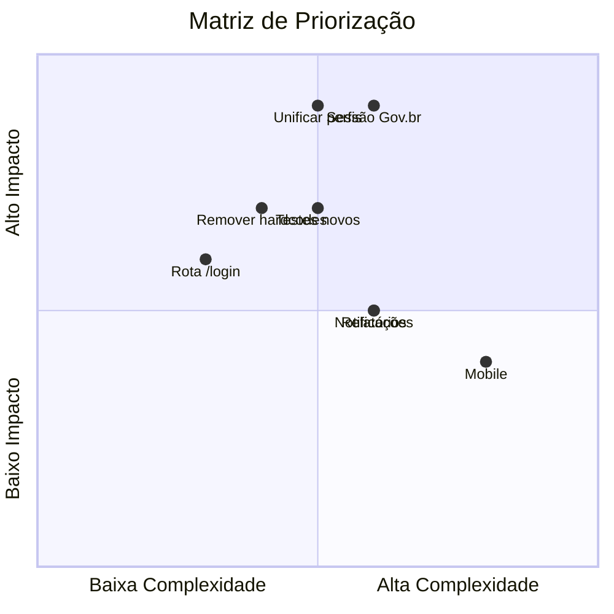

# Roadmap — Próximos Passos

## Curto Prazo (1-3 meses)

### 1. Unificar Perfis de Usuário (Alta prioridade)

- [ ] Definir um único mapeamento `profileId` (1=master, 2=diretor, 3=admin, 4=professor)
- [ ] Migrar o dashboard legado para o novo mapeamento
- [ ] Atualizar `user.types.tsx` / `/api/auth/me` para expor perfil consistente
- [ ] Atualizar guards (`/classes`, `/minhas-aulas`, `/master`)

### 2. Corrigir Sessão Gov.br (Alta prioridade)

- [ ] Unificar persistência de token (cookie httpOnly vs localStorage)
- [ ] Fazer o middleware reconhecer sessões Gov.br
- [ ] Unificar `useUserHook` e `useGovbrAuth`

### 3. Remover Valores Hardcoded

- [ ] Cadastro: usar `profileId` e `schoolId` reais (hoje `3` e `1` fixos)
- [ ] `/master/professores`: substituir `schoolId='school-1'` pela sessão
- [ ] Dashboard: substituir mapeamento legado de perfis

### 4. Testes

- [ ] Testes para `/classes`, `/minhas-aulas`
- [ ] Testes para hooks (`useEnrollments`, `useEnrollmentMutations`, `useSubstitutionLimit`, `useSchools`, `useUsers`, `useTeachers`)
- [ ] Testes para services (`enrollment`, `master`, `teacher`, `auth`)
- [ ] Testes para área master (páginas)

### 5. Correções de Rotas e Navegação

- [ ] Criar rota `/login` (redirects apontam para `/login`, mas o login está em `/`)
- [ ] Usar `MasterHeader` no layout master (hoje não importado)

## Médio Prazo (3-6 meses)

### UX/UI
- [ ] Biblioteca de componentes reutilizáveis
- [ ] Skeleton loading e spinners padronizados
- [ ] Error Boundaries
- [ ] Sistema de temas (Theme Provider)

### Qualidade de Código
- [ ] Remover todos os `@ts-ignore` e `any`
- [ ] Padronizar tipos (`EnrollmentRequest`, `EnrollmentStatus` duplicados)
- [ ] Centralizar chamadas diretas (dashboard/cadastro) nos services
- [ ] Refatorar `UserForm` duplicado (diretores/administradores)
- [ ] Unificar `Class.date` e `Class.statededAt`

### Notificações
- [ ] Notificação de novas vagas para professores
- [ ] Notificação de aprovação/rejeição

### Relatórios
- [ ] Dashboard com estatísticas detalhadas por escola
- [ ] Histórico completo de substituições
- [ ] Exportação (PDF/Excel)

## Longo Prazo (6-12 meses)

### Segurança e Conformidade
- [ ] Substituir hash SHA1 por algoritmo seguro (ex.: bcrypt no backend)
- [ ] Validar JWT no middleware (hoje verifica apenas presença)
- [ ] Remover `console.log` do payload do token em `/api/auth/me`

### Mobile
- [ ] Aplicativo React Native consumindo a mesma API
- [ ] Push notifications

### Integração IoT (visão de futuro)
- [ ] Prova de conceito com sensores de presença
- [ ] Validação automatizada de presença

## Priorização

## Como Contribuir

1. Verificar as Issues no GitHub
2. Criar branch no padrão `<issue>-<descricao>` (ex.: `001-master-admin-area`)
3. Seguir as [convenções de código](../02-guia-desenvolvimento/convencoes.md)
4. Escrever testes antes/durante a implementação
5. Atualizar a documentação em `docs/` quando aplicar
6. Criar PR com descrição completa

## Referências

- [Estado Atual](./estado-atual.md)
- [Problemas Conhecidos](./problemas-conhecidos.md)
- [Regras de Negócio](../01-visao-geral/regras-de-negocio.md)
- [Convenções de Código](../02-guia-desenvolvimento/convencoes.md)