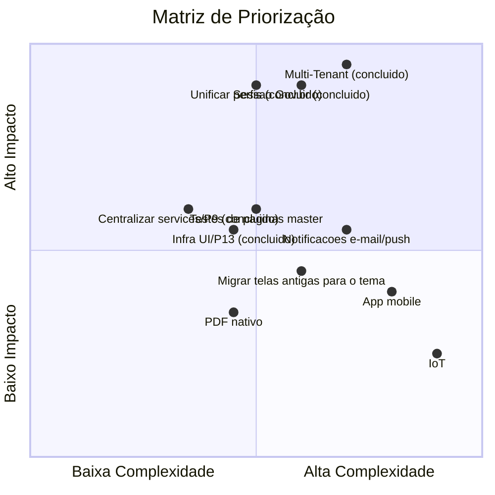

# Roadmap — Próximos Passos

> **Next.js atualizado para 16.3.6 (era 15.3.2)** — corrige CVE-2025-66478. Mudança relevante: `src/middleware.ts` foi renomeado para `src/proxy.ts` (`export function middleware` → `export function proxy`), convenção obrigatória a partir do Next 16; o arquivo não roda mais em Edge Runtime, sempre Node.js (sem impacto funcional, `jose` funciona igual nos dois). `pnpm run lint` passou a chamar `eslint .` direto (`next lint` foi removido do framework). App já estava em conformidade com as outras breaking changes (Async Request APIs, sem `next/legacy/image`, sem rotas paralelas). Validado com `tsc`, `next build` (20 rotas + proxy) e `next start` real (`/` → 200, `/classes` sem cookie → 307, `/api/auth/me` sem cookie → 401). Referências a `middleware.ts` como arquivo atual foram varridas em `docs/`/`specs/` nesta rodada; restam apenas as notas históricas da renomeação (como esta).
>
> **Última atualização: 28/09/2026** — além da rodada anterior (P5/P7/P8/P9/P10/P14/P16 e telas de auditoria/jornada/indicadores/senha), entraram: **Fase 5** (grupos de prioridade por escola, interesse/exclusão do professor e interconexão de redes — telas `/escola/prioridade` e `/minhas-preferencias` e modal de interconexões em `/master/redes`), **exportação PDF nativa** (jsPDF) e **notificação por e-mail** (backend, opcional sem SMTP). Suíte: **238/238 testes em 53 arquivos**. Detalhes em [problemas-conhecidos.md](./problemas-conhecidos.md).
>
> **Evolução Multi-Tenant:** ver [`design-doc-evolucao-multi-tenant.md`](../../../docs/design-doc-evolucao-multi-tenant.md) na raiz do projeto. Fase 3 (frontend: `SchoolContext`, seletor de escola ativa, correção do mapeamento de perfis, remoção de hardcodes) **implementada** — ver seção "Multi-Tenant" abaixo.

## Curto Prazo (1-3 meses)

### 1. Unificar Perfis de Usuário (Alta prioridade) — ✅ Concluído (Fase 3)

- [x] Definir um único mapeamento `profileId` em `src/constants/profile.ts` — valor REAL confirmado contra o backend: `DIRETOR=1, AUXILIAR_ADMIN=2, PROFESSOR=3, MASTER=4` (o mapeamento antigo planejado aqui, `1=master,2=diretor,3=admin,4=professor`, também estava errado)
- [x] Migrar o dashboard legado para o novo mapeamento
- [x] Atualizar `user.types.tsx` / `/api/auth/me` para expor perfil consistente (e todos os vínculos do usuário, `schoolLinks`)
- [x] Atualizar guards (`/classes`, `/minhas-aulas`, `/master`) — corrigido bug real: `/master` liberava DIRETOR e bloqueava MASTER

### 2. Corrigir Sessão Gov.br (Alta prioridade) — ✅ Concluído

- [x] Unificar persistência de token (cookie httpOnly vs localStorage) — nova rota `POST /api/auth/govbr-session` grava o JWT do Gov.br como cookie httpOnly, igual ao login tradicional
- [x] Fazer o proxy reconhecer sessões Gov.br — automático, já que agora é o mesmo cookie
- [x] Unificar `useUserHook` e `useGovbrAuth` — `useUserHook` virou wrapper deprecated do `SchoolContext` (fonte única de sessão); `useGovbrAuth` permanece separado por ser o fluxo de login OAuth, não uma fonte de sessão

### 3. Remover Valores Hardcoded — ✅ Concluído (Fase 3)

- [x] Cadastro: `profileId`/`schoolId` removidos do payload (o backend real não aceita esses campos em `POST /users`)
- [x] `/master/professores`: `schoolId='school-1'` substituído pela escola ativa do `SchoolContext`
- [x] Dashboard: mapeamento legado de perfis substituído por `src/constants/profile.ts`
- [x] **P15** (era achado novo, agora corrigido): módulo de vínculo/criação de professores reescrito em dois passos (`POST /users` + `assign-profile`/`unassign-profile`) — ver `problemas-conhecidos.md`

### 4. Testes — 🟡 Em andamento (202/202 em 45 arquivos)

- [x] Já cobertos: login/cadastro, dashboard legado, `/classes`, `/minhas-aulas`, `/alterar-senha`, `/master/auditoria`, `/master/dashboard`, `/minha-jornada`, `/escola/indicadores`, `SchoolContext`, `useUserHook`, `useNotifications`, `useGovbrAuth`, `useSubstitutionLimit`, `useSchools`, `useUsers`, `useTeachers`, services `auth`/`classes`/`enrollment`/`teacher`, `ErrorBoundary` e hooks de relatórios/fechamento
- [ ] Faltam: páginas master restantes (`diretores`, `administradores`, `escolas`, `professores`, `redes`, `políticas-carga-horaria`); fluxos de escola (`fechamento-ponto`, `jornada-docente`); service `master`; hooks `useEnrollments`, `useEnrollment`, `useMaster`/`useMasterDashboard`, `useSubjects`

### 5. Correções de Rotas e Navegação — ✅ Concluído

- [x] Redirects para `/login` corrigidos para `/` (a rota nunca existiu — o login vive em `/`): `classes/page.tsx`, `minhas-aulas/page.tsx`, `escola/layout.tsx`, `useMaster.ts`, `master/layout.tsx` (P5)
- [x] Usar `MasterHeader` no layout master — agora entra entre a sidebar e o conteúdo, com o nome real do usuário vindo do `SchoolContext` (P10)

## Médio Prazo (3-6 meses)

### Multi-Tenant (Fase 3 do Design Doc) — ✅ Concluído nesta rodada
- [x] `SchoolContext` (estado global de sessão, substitui fetch repetido do `useUserHook`)
- [x] Seletor de escola ativa persistente (`SchoolSelector`, oculto quando só há um vínculo)
- [x] Consumir o claim de `networkId` (Rede de Ensino) — `SchoolContext.activeNetworkId`, exposto por `/api/auth/me` a partir do JWT; `/master/auditoria` já abre na rede do vínculo ativo

### UX/UI
- [ ] Biblioteca de componentes reutilizáveis — parcial: `AdminTable` e `Skeleton` em `src/components/ui/`; telas antigas ainda repetem estilos
- [x] Skeleton loading e spinners padronizados — `src/components/ui/Skeleton.tsx` (adotado nas telas novas)
- [x] Error Boundaries — `src/components/ErrorBoundary.tsx`, montado no layout raiz
- [x] Sistema de temas (Theme Provider) — `src/components/ThemeProvider.tsx` + `src/styles/theme.ts`

### Qualidade de Código
- [x] Remover todos os `@ts-ignore` e `any` — regras reativadas no `eslint.config.mjs` para o código de aplicação (liberadas apenas em `tests/**`)
- [x] Padronizar tipos (`EnrollmentRequest`, `EnrollmentStatus` duplicados) — fonte única em `src/types/enrollment.ts`; ids numéricos em `Teacher`/`Subject`/`EnrollmentRequest`/`UserData`
- [x] Centralizar chamadas diretas (dashboard/cadastro) nos services — dashboard migrado para `classesService`/`schoolsService`, via `api-client.service` (P9)
- [x] Refatorar `UserForm` duplicado (diretores/administradores) — movido para `src/app/master/components/UserForm.tsx`
- [x] Unificar `Class.date` e `Class.statededAt` — `Class.date` removido; só `statededAt`

### Notificações
- [x] Notificação in-app de novas vagas (professores/gestão), aprovação/rejeição (professor) e candidaturas pendentes (MASTER) — `useNotifications` + `NotificationBell` no dashboard e no MasterHeader
- [x] Notificação por e-mail de aprovação/rejeição e de nova vaga — `EmailService` no backend (nodemailer), opcional: sem `SMTP_HOST`, vira no-op
- [ ] Notificações por e-mail/push

### Relatórios
- [x] Dashboard com estatísticas detalhadas por escola — `/escola/indicadores` (coverage-stats da Fase 4)
- [x] Histórico completo de substituições — `/escola/indicadores`; log de auditoria por rede em `/master/auditoria`
- [x] Exportação: CSV, impressão e **PDF nativo** (jsPDF) — em `/escola/indicadores` (indicador + histórico) e por relatório em `/escola/fechamento-ponto`

## Longo Prazo (6-12 meses)

### Segurança e Conformidade
- [x] Substituir hash SHA1 por algoritmo seguro — frontend não pré-hasheia mais a senha (P3); backend usa bcrypt e migra hashes legados de forma lazy
- [x] Validar JWT no proxy — `jose.jwtVerify`, cookie inválido/expirado agora é barrado na borda (P6)
- [x] Remover `console.log` do payload do token em `/api/auth/me` — já removido junto do P0 (ver problemas-conhecidos.md)

### Mobile
- [ ] Aplicativo React Native consumindo a mesma API
- [ ] Push notifications (o sino in-app não cobre notificação fora do app)

### Integração IoT (visão de futuro)
- [ ] Prova de conceito com sensores de presença
- [ ] Validação automatizada de presença

## Priorização

## Como Contribuir

1. Verificar as Issues no GitHub
2. Criar branch no padrão `<issue>-<descricao>` (ex.: `001-master-admin-area`)
3. Seguir as [convenções de código](../02-guia-desenvolvimento/convencoes.md)
4. Escrever testes antes/durante a implementação
5. Atualizar a documentação em `docs/` quando aplicar
6. Criar PR com descrição completa

## Referências

- [Estado Atual](./estado-atual.md)
- [Problemas Conhecidos](./problemas-conhecidos.md)
- [Regras de Negócio](../01-visao-geral/regras-de-negocio.md)
- [Convenções de Código](../02-guia-desenvolvimento/convencoes.md)
