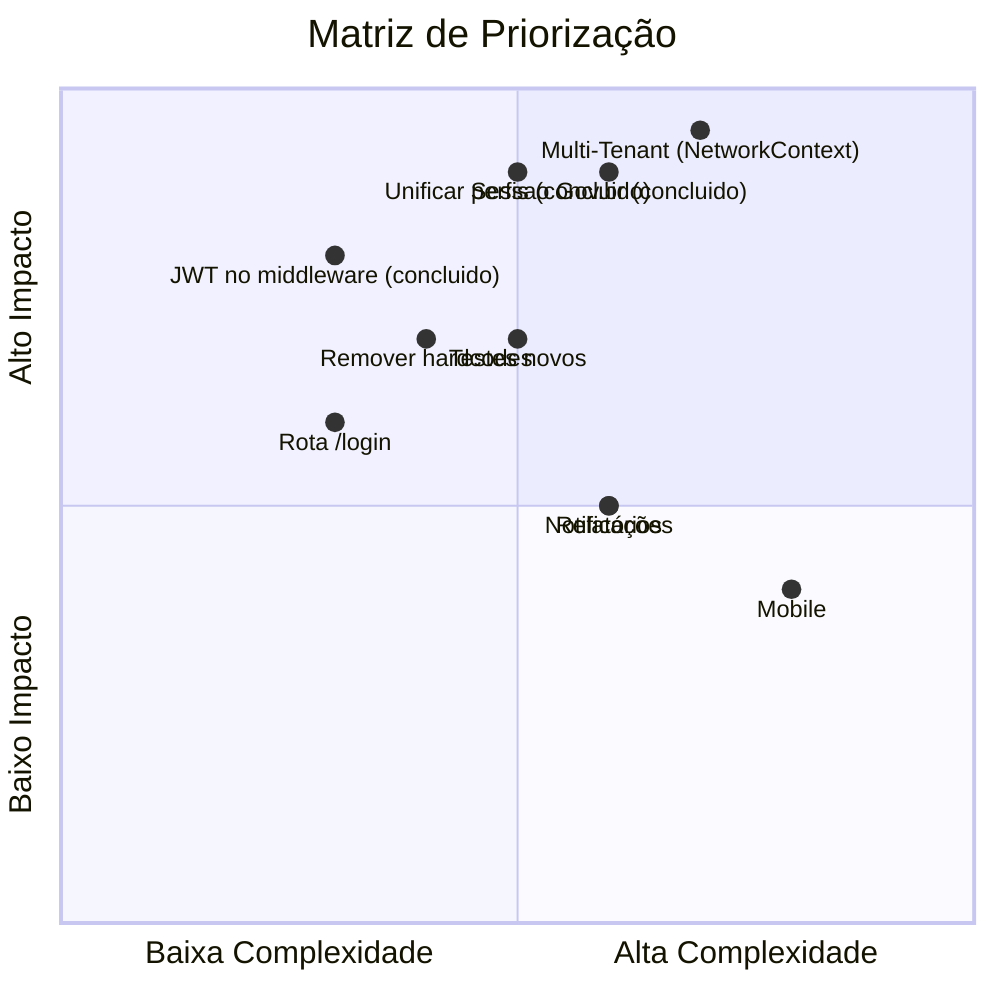

# Roadmap — Próximos Passos

> **Evolução Multi-Tenant:** ver [`design-doc-evolucao-multi-tenant.md`](../../../docs/design-doc-evolucao-multi-tenant.md) na raiz do projeto. Fase 3 (frontend: `SchoolContext`, seletor de escola ativa, correção do mapeamento de perfis, remoção de hardcodes) **implementada** — ver seção "Multi-Tenant" abaixo.

## Curto Prazo (1-3 meses)

### 1. Unificar Perfis de Usuário (Alta prioridade) — ✅ Concluído (Fase 3)

- [x] Definir um único mapeamento `profileId` em `src/constants/profile.ts` — valor REAL confirmado contra o backend: `DIRETOR=1, AUXILIAR_ADMIN=2, PROFESSOR=3, MASTER=4` (o mapeamento antigo planejado aqui, `1=master,2=diretor,3=admin,4=professor`, também estava errado)
- [x] Migrar o dashboard legado para o novo mapeamento
- [x] Atualizar `user.types.tsx` / `/api/auth/me` para expor perfil consistente (e todos os vínculos do usuário, `schoolLinks`)
- [x] Atualizar guards (`/classes`, `/minhas-aulas`, `/master`) — corrigido bug real: `/master` liberava DIRETOR e bloqueava MASTER

### 2. Corrigir Sessão Gov.br (Alta prioridade) — ✅ Concluído

- [x] Unificar persistência de token (cookie httpOnly vs localStorage) — nova rota `POST /api/auth/govbr-session` grava o JWT do Gov.br como cookie httpOnly, igual ao login tradicional
- [x] Fazer o middleware reconhecer sessões Gov.br — automático, já que agora é o mesmo cookie
- [ ] Unificar `useUserHook` e `useGovbrAuth` de fato em um único hook (ficaram unificados na fonte de sessão, mas ainda são dois hooks distintos — refatoração de conveniência, não bloqueia nada)

### 3. Remover Valores Hardcoded — ✅ Concluído (Fase 3)

- [x] Cadastro: `profileId`/`schoolId` removidos do payload (o backend real não aceita esses campos em `POST /users`)
- [x] `/master/professores`: `schoolId='school-1'` substituído pela escola ativa do `SchoolContext`
- [x] Dashboard: mapeamento legado de perfis substituído por `src/constants/profile.ts`
- [x] **P15** (era achado novo, agora corrigido): módulo de vínculo/criação de professores reescrito em dois passos (`POST /users` + `assign-profile`/`unassign-profile`) — ver `problemas-conhecidos.md`

### 4. Testes

- [ ] Testes para `/classes`, `/minhas-aulas`
- [ ] Testes para hooks (`useEnrollments`, `useEnrollmentMutations`, `useSubstitutionLimit`, `useSchools`, `useUsers`, `useTeachers`)
- [ ] Testes para services (`enrollment`, `master`, `teacher`, `auth`)
- [ ] Testes para área master (páginas)

### 5. Correções de Rotas e Navegação

- [ ] Criar rota `/login` (redirects apontam para `/login`, mas o login está em `/`)
- [ ] Usar `MasterHeader` no layout master (hoje não importado)

## Médio Prazo (3-6 meses)

### Multi-Tenant (Fase 3 do Design Doc) — ✅ Concluído nesta rodada
- [x] `SchoolContext` (estado global de sessão, substitui fetch repetido do `useUserHook`)
- [x] Seletor de escola ativa persistente (`SchoolSelector`, oculto quando só há um vínculo)
- [ ] Consumir o claim de `networkId` (Rede de Ensino) quando o backend expuser esse campo no JWT/`/auth/me` (depende da Fase 2 do Design Doc já ter `Networks` no schema — falta o claim chegar ao token)

### UX/UI
- [ ] Biblioteca de componentes reutilizáveis
- [ ] Skeleton loading e spinners padronizados
- [ ] Error Boundaries
- [ ] Sistema de temas (Theme Provider)

### Qualidade de Código
- [ ] Remover todos os `@ts-ignore` e `any`
- [ ] Padronizar tipos (`EnrollmentRequest`, `EnrollmentStatus` duplicados)
- [ ] Centralizar chamadas diretas (dashboard/cadastro) nos services
- [ ] Refatorar `UserForm` duplicado (diretores/administradores)
- [ ] Unificar `Class.date` e `Class.statededAt`

### Notificações
- [ ] Notificação de novas vagas para professores
- [ ] Notificação de aprovação/rejeição

### Relatórios
- [ ] Dashboard com estatísticas detalhadas por escola
- [ ] Histórico completo de substituições
- [ ] Exportação (PDF/Excel)

## Longo Prazo (6-12 meses)

### Segurança e Conformidade
- [ ] Substituir hash SHA1 por algoritmo seguro (ex.: bcrypt no backend)
- [x] Validar JWT no middleware — `jose.jwtVerify`, cookie inválido/expirado agora é barrado na borda (P6)
- [x] Remover `console.log` do payload do token em `/api/auth/me` — já removido junto do P0 (ver problemas-conhecidos.md)

### Mobile
- [ ] Aplicativo React Native consumindo a mesma API
- [ ] Push notifications

### Integração IoT (visão de futuro)
- [ ] Prova de conceito com sensores de presença
- [ ] Validação automatizada de presença

## Priorização

## Como Contribuir

1. Verificar as Issues no GitHub
2. Criar branch no padrão `<issue>-<descricao>` (ex.: `001-master-admin-area`)
3. Seguir as [convenções de código](../02-guia-desenvolvimento/convencoes.md)
4. Escrever testes antes/durante a implementação
5. Atualizar a documentação em `docs/` quando aplicar
6. Criar PR com descrição completa

## Referências

- [Estado Atual](./estado-atual.md)
- [Problemas Conhecidos](./problemas-conhecidos.md)
- [Regras de Negócio](../01-visao-geral/regras-de-negocio.md)
- [Convenções de Código](../02-guia-desenvolvimento/convencoes.md)